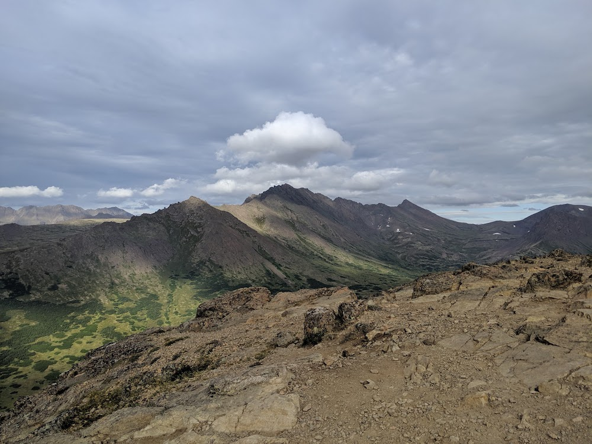
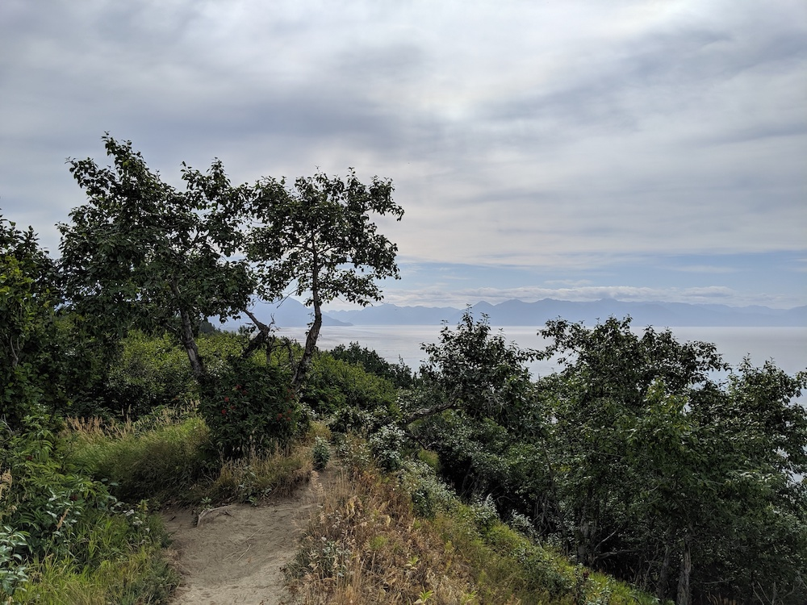

 
 <i>Flattop Mountain - Only a 1 hour hike with a 20 min scramble at the end to get views that normally take a half day trek.</i>

We were in Anchorage for a conference and did not miss the opportunity to explore local trails. We also had time to sneak in an easy hike with a huge payoff: <a href="https://www.alltrails.com/trail/us/alaska/flattop-mountain">Flattop Mountain</a>. Whenever I visit a new city, I work to find a community of like minded folks that can plug me into the community. I ventured out to [AMH](https://www.alaskamountaineering.com) a fantastic mountaineering shop with a selection of rare pro-gear. They pointed me to a mountain bike shop near by that would rent us bikes. The nearest trail network, Kincaid Park was 10 miles on the beautiful [Coastal Trail](https://www.trailforks.com/trails/coastal-trail-138216/).

  
<i>Photo from [Bluff Trail](https://www.trailforks.com/trails/bluff-trail-138342/)</i>

Kincaid park surprised me! The signage, maintenance, and overall trail design reminded me of [The Evergreen Mountain Bike Alliance's](https://www.evergreenmtb.org) great work in Washington. One of the most memorable trails was [Nortwest Passage](https://www.trailforks.com/trails/northwest-passage-56371/) which provided a literally breath taking (unexpected and beautiful) view that hits you in the middle of a ski jump step up. You are mid-air, and for a second all you can see is the vast ocean views before you spot the ground.
 

We really loved a very fast, almost pump track, section of [Bowling Alley](https://www.trailforks.com/trails/bolling-alley/). This was one of those trails where you are constantly accelerating off of natural terrain features.

  
<i>We saw a moose from a safe distance on the Coastal Trail, and a bear from the car on the way to Flattop.</i>

A few days later we borrowed fat bikes and took a long road ride to [Hillside Park](https://www.trailforks.com/region/hillside-park/). We figured we would be toast by the time we got there, but wanted to recon the trails in case we came back someday with proper mountain bikes. We rode on the Salmon Run trail, and as you would expect there were these kinds of signs everywhere. This park had great spots for accessing the river. 

<iframe height='405' width='590' frameborder='0' allowtransparency='true' scrolling='no' src='https://www.strava.com/activities/2588362160/embed/68b6da52bfbcafad59066fd447b6ae274c7697fe'></iframe>
 
