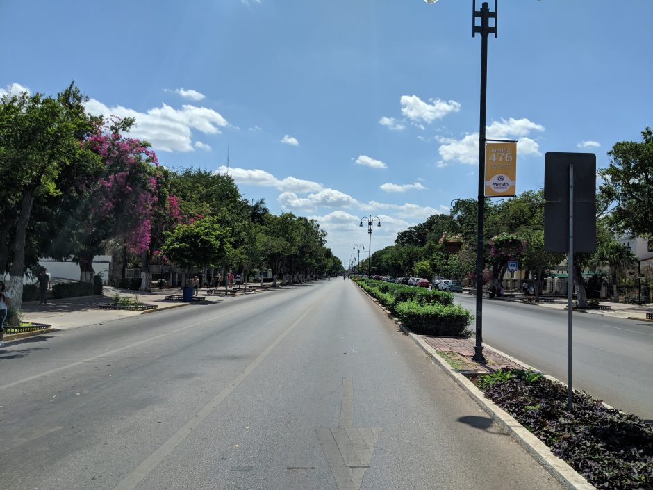

 Monumento a la Patria at the End of Paseo Montejo

Merida is a beautiful unique city with the styling and diversity that an average American tourist would expect out of cities in western Europe. One of my most memorable experiences during my weeks bushwhacking in the Yucatan was cruising along the beautiful wide tree-lined streets of Paseo de Montejo during the Sunday <a href="http://www.merida.gob.mx/biciruta/">Bici-Ruta</a>. The city closes a series of streets to all automobile traffic every Sunday. This strip was modeled after the Champs de Elisye and showcases the mansions of the 1800's.

The long car-less Paseo Montejo. What a dream if this could be everyday.

<iframe src="https://www.strava.com/activities/1436536571/embed/dbd0b4cf72857f78cf0226289a4a1280f0f94d28" width="590" height="405" frameborder="0" scrolling="no" data-mce-fragment="1">&amp;amp;lt;span data-mce-type="bookmark" style="display: inline-block; width: 0px; overflow: hidden; line-height: 0;" class="mce_SELRES_start"&amp;amp;gt;&amp;amp;lt;/span&amp;amp;gt;</iframe>

