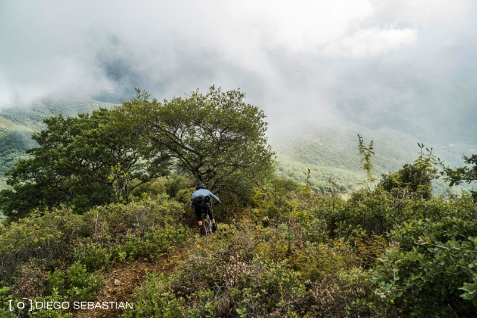

About 80 of us from around the world headed east to the Oaxacan “Sierra Norte” located about 1.5 hours from Oaxaca city for the [Transierra Norte](https://transierranorte.com). My photos do not do this beautiful state justice so take a look at [pictures of last year's event.](https://www.pinkbike.com/news/oaxacas-transierranorte-2017-photo-epic.html)  
  
Diego snaped me going down what I think was a stage on day 3.

[The trails](https://www.trailforks.com/region/etla-16279/?activitytype=1&z=10.8&lat=17.20731&lon=-96.68012) were so spectacularly long and started at such a high altitude (+10k ft), that we'd see many distinct ecosystems and terrain over the course of one stage. We even had a few days that terminated in a middle of a remote town where we'd get shuttled back to base camp.

Oaxaca felt magical to me the entire time. The air, wildlife, and terrain were unlike anything I've experienced. If you live in LA you have access to the best food in the world, and what Oaxaca offered in the city and out in back country was incredible in its own right. My favorite and most memorable aspect of the event was the very isolated camp site.  
  
The benefit of bunking with 2 firefighters. We all knew how to start and maintain a fire and were some of the very few to have a fireplace in their cabin. I was so thankful to not have to put soaked gear back on the next day.

<iframe height='405' width='590' frameborder='0' allowtransparency='true' scrolling='no' src='https://www.strava.com/activities/1944317650/embed/0eeaba46988c4617888f2fb60311ce906d6ed0fb'></iframe>
