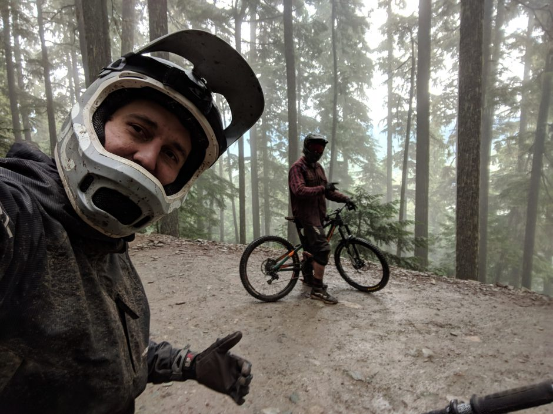

This shot of Christian on <a href="https://www.trailforks.com/trails/in-deep/">In Deep</a>&nbsp;captures the relentless tech of what is probably the hardest double-black technical trail on Whistler.

<a href="https://www.google.com/maps/place/Whistler+Mountain/@49.9133802,-123.2218417,9.02z/data=!4m5!3m4!1s0x5487225af28c5409:0x276c0edfa7be2148!8m2!3d50.0591666!4d-122.9569443">Whistler</a> is at the end of&nbsp; a long steep windy road (BC-99) along the beautiful Howe Sound.&nbsp; The drive makes you wonder how drivers navigate it safely in the snow. We rode about 80% of the trails offered over our 3 day stay in <a href="http://www.whistlercreeksidevillage.com/">Creekside</a>. If you care to avoid the commercial hustle and bustle of the main village, I highly recommend staying at Creekside, which offers non-congested lift access and a compliment of its own great trails. You can even take the Creekside Gondola to Big Red Express to then take down service on Whistler Village Gondola to get to the top of the Fitzsimmons area (<a href="https://www.whistlerblackcomb.com/the-mountain/about-the-mountain/trail-maps.aspx">trail map here</a>).

As a testament to the incredible trail networks in our backyard in Seattle and Bellingham, manage your expectations. You might find that the only unique trails at Whistler are the massive machine made, air-sailing trails like A-Line. You'll have more endurance to do multiple runs and have more confidence sailing through the air on a true DH-bike.&nbsp;If you want to take a break away from the mountain or ride with the whole family there are a <a href="https://www.trailforks.com/region/whistler/?lat=50.132601&amp;lon=-122.978085&amp;z=13&amp;m=trailforks">TONS of trails</a> to ride in the valley. You can find road, gravel, and cross country trails.

Riding <a href="https://www.trailforks.com/trails/crank-it-more/">C-More</a>&nbsp;after getting soaked on <a href="https://www.trailforks.com/trails/delayed-fuse/">Delayed Fuse</a>.

<iframe src="https://www.strava.com/activities/1672873175/embed/b0172fad37b2c66df9f9b3367044230e4d239d9e" width="590" height="405" frameborder="0" scrolling="no"></iframe>
