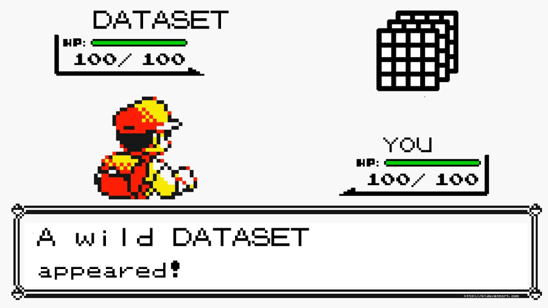
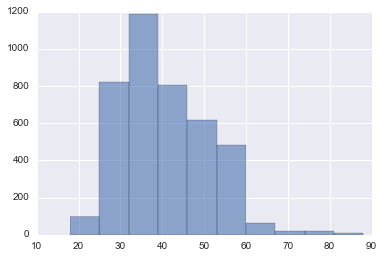

Where do we start when we stumble across a dataset we don’t know much about? Lets say one where we don’t necessarily understand the underlying generative process for some or all of the variables. Lets assume for now we’re sure there aren’t one off interventions or level shifts in the data, and we don’t know anything about the distribution of the features, trends, seasonality, model parameters, variance, etc.

I tend to start with the simplest, most interpretable models first, regardless if the problem requires classification, regression, or causality modeling. This allows me to assess how difficult the problem is before wasting time applying a complex solution.





The IPython notebook below will outline exploratory analysis in terms of 1) Histograms and Aggregation, 2) Correlation Structure , 3) Dimensional Reduction. Note this isn’t meant to be an exhaustive effort to enumerate all types of imputation and pre-processing, but a quick examination of some best practices.

```python
import time
import csv
import pickle
import random
import time
import numpy as np
import pandas as pd
import pylab as plt
import seaborn as sns
from functools import wraps
from matplotlib.font_manager import FontProperties
from scipy import interp
import matplotlib.pyplot as plt
from sklearn import cross_validation
from sklearn import neighbors
from sklearn import preprocessing
from sklearn import tree
from sklearn.ensemble import AdaBoostClassifier
from sklearn import svm
from sklearn.learning_curve import learning_curve
from sklearn.metrics import accuracy_score
from sklearn.cross_validation import train_test_split
from sklearn.metrics import roc_curve, auc
from sklearn.metrics import confusion_matrix
from sklearn.decomposition import PCA

%matplotlib inline

%%html
<!-- just to make a markdown table pretty -->
<style>table {float:left}</style>
```

## Our Example Data
[This data](http://archive.ics.uci.edu/ml/datasets/Bank+Marketing) is from phone call based direct marketing campaigns of a Portuguese banking institution. The output is whether a customer signed up for the financial product.

Why might this dataset be interesting?
There are progressively more platforms to reach customers such as social media, broadcast media, and physical advertisements. Due to the many input streams and the advancement of comparison shopping, conventional marketing campaigns have a reduced effect on the general public. Competition and budget constraints demand that marketing teams invest on highly refined and directed campaigns that maximize their Return On Investment. Modern campaigns can be created with the use of advanced analytics.

This is a particularly interesting dataset as it seeks to optimize an older and conventional business medium, where as recent optimization involves mobile applications or ad-sponsored streaming media. The data contains many interpretable social and economic features thus it will be interesting to see if the stratifying effects of these nominal, ordinal, and numeric variables is intuitive.

In the interest of time I won't step through our analysis and rationale of every single feature like I did in my Lending Club Data Analysis Blog Post, but we will explore a few. Our pre-processing includes dropping predictors with no power, dummy encoding, and standardization. This is a binary classification problem. What our data will end up like after pre-processing:
<table>
<thead>
<tr>
<th><strong>State</strong></th>
<th><strong>Observations</strong></th>
<th><strong>Features</strong></th>
</tr>
</thead>
<tbody>
<tr>
<td><strong>Original</strong></td>
<td>25211</td>
<td>20</td>
</tr>
<tr>
<td><strong>Pre-processing</strong></td>
<td>4119</td>
<td>63</td>
</tr>
</tbody>
</table>

```python
data = pd.read_csv('data/bank-additional1.csv')
# Data was already randomized by author
data_labels = pd.Series([0 if x == 'no' else 1 for x in data.ix[:,-1]])

print("Head of data")
print(data.ix[1])
```
```
Head of data
age                        39
job                  services
marital                single
education         high.school
default                    no
housing                    no
loan                       no
contact             telephone
month                     may
day_of_week               fri
duration                  346
campaign                    4
pdays                     999
previous                    0
poutcome          nonexistent
emp.var.rate              1.1
cons.price.idx         93.994
cons.conf.idx           -36.4
euribor3m               4.855
nr.employed              5191
y                          no
Name: 1, dtype: object
```
## Exploratory Analysis
The typical things I do in order are as follows:

### 1. Histograms and Aggregation/Facets/Pivots
An easy place to start is to examine histograms (or scatterplots) of the features to discover characteristics such as sparsity, few unique values, distribution (is it heavy tailed or normally distributed).

Some plots are pretty intuitive like this facetgrid which shows density plots of the respondant age faceted by outcome label (yes/no) and if they were contacted by cell or land line. We can expect a larger count of older respondents for land lines.

```python
g = sns.FacetGrid(data, row="contact", col="y", margin_titles=True)
g.map(sns.distplot, "age")
```


options="700x" >}}

Taking a look at the distribution of the ages in the dataset, it looks probably there wasn't a concerted effort to target a specific age class. The plot of the general workforce population might be similar.

```python
data.age.hist(alpha=.6)
```



## Feature-Target Distributions
These class histograms conditioned on feature values help us identify features with predictive power. Is there a telling difference between the age distribution? between respondents of different outcomes? Note that the histogram is expressed in densities and not in frequencies here for plotting purposes. We can tell very quickly that older respondents signed up for the solicited product more often in this sample. A box-plot could tell the same story.

```python
sns.kdeplot(data.query("y == 'no'").age, shade=True, alpha=.2, label='No', color='salmon')
sns.kdeplot(data.query("y == 'yes'").age, shade=True, alpha=.2, label='Yes',color='dodgerblue')

plt.show()
```


Let's examine our outcome variable pivoted by poutcome which describes the outcome of the previous marketing campaign/contact ('failure','nonexistent','success').

```python
gb = data.groupby(by=["poutcome","y"])
gbs = gb.size()
gbs
```

```
poutcome     y  
failure      no      387
             yes      67
nonexistent  no     3231
             yes     292
success      no       50
             yes      92
dtype: int64
```
Respondents that were a success before, were a success again at 10x the rate of previous failures.

```python
gbs[1]/gbs[0] , gbs[3]/gbs[2], gbs[5]/gbs[4]
```
`(0.1731266149870801, 0.090374497059733827, 1.8400000000000001)`

### Imbalanced Data
If we examine the table above we see a severe distortion of outcomes which may distort the performance of the algorithms we choose to deploy. Test accuracy is not robust in this situation as most models will tend to fit the majority class better (more observations) which may indirectly bring up the overall accuracy. If we care more about recall than precision, that is more success identifying respondents that will sign up for the banking product versus our general ability to classify yes vs no respondents, we might want to use the ROC (Receiver Operating Characteristic) curve and AUC (Area Under Curve ) as a a performance measurement. More on this in other general posts, but to drive intuition I'll give an example: In this dataset 90% of the responses are 'No'. So if we created a naive model that always predicted 'No', we'd have ridiculously high accuracy.

Another way to address this heavy biased data set is to create a new one with resampling such as sampling with replacement from the group with less data until the number equals to the larger group and vice versa.

UnbalancedDataset is a python package offering a number of re-sampling techniques commonly used in datasets showing strong between-class imbalance.

### Missing Data
Although not necessary to produce a plot for, tabular views of the data can help us discover variables that may need imputation. For a quick look at data imputation methods in Pandas look here. We can go from simple imputation like columnwise mean filling, or polynomial approximation for time series, to linear regression (using what we know about other variables), to complex meta-methods (ignoring our class and using ML algos to predict the missing data).

## Correlation Structure
Feature-Target Correlation
Here we can use correlation measures like mutual information, pearson's correlation coefficient, or chi-squared, based on the type of feature and class we are examining (categorical or numeric)

Below we use Mutual Information. There are many methods more advanced the typical mutual information measure we used here which uses Kullback-Leibler divergence. For example there are versions based on quadratic divergence measures which don't require prior assumptions about class densities (assumption of independence). In this example we see a similar importance for poutcome as we did before with our simple aggregation table.

```python
from sklearn import metrics
f_list = ['education','job','marital','contact','campaign','duration','loan','poutcome']
sorted([(feature,metrics.adjusted_mutual_info_score(data[feature],data['y'])) for feature in f_list],
       key=lambda x: x[1], reverse=True)
```
```
[('poutcome', 0.065587942670630867),
 ('contact', 0.015942038384609447),
 ('duration', 0.014895700838497688),
 ('job', 0.0031057910819885454),
 ('campaign', 0.0014596269197607321),
 ('education', 0.0011151723310124562),
 ('marital', 0.00089561182867500366),
 ('loan', -0.00018340180508122201)]
 ```

### How many features do we have really?
Here we can use PCA or another dimensionality reduction tool to examine structure. Sometimes this allows us to quickly discover the true dimensionality of the data, do we really have 500 features or is it really only 50? If using PCA I like to take a look at the sorted eigenvalues and examine if their values tend to decay slowly or rapidly. If I notice a fast drop off I can identify that there is a lot of structure in fewer features. In the case where the drop off is slower, I might have a harder time finding structure in the data.

More concretely what we're doing is:

- Obtaining Eigenvectors and Eigenvalues from the covariance or correlation matrix.
- Sorting eigenvalues in descending order to choose the k eigenvectors which correspond to the k largest eigenvalues where k is the number of dimensions of the new feature subspace (k≤d).
- Construct the projection matrix W from the selected k eigenvectors.
- Transform the original dataset X via W to obtain a k-dimensional feature subspace Y.

*Note: Eigendecomposition of the covariance or correlation matrix may be more intuitiuve; however, most PCA implementations perform a Singular Vector Decomposition (SVD) to improve the computational efficiency*

For a simple intuition to PCA see an execllent tutorial [here](http://sebastianraschka.com/Articles/2015_pca_in_3_steps.html).

Let's finish pre-processing our data to get a completely numerical representation of the feature space.

```python
# Boiler Plate pre-processing

test_size=.33

pp_data = data.copy()

# Scale numeric data
dts_cols = [0,10, 11, 12,13,15,16,17,18,19]
data_to_scale = pp_data.iloc[:, dts_cols].astype(np.float)  # change int to float
scaler = preprocessing.StandardScaler().fit(data_to_scale)
pp_data.iloc[:, dts_cols] = scaler.transform(data_to_scale)

# Create dummy encoding for categorical data
dtde_cols = [1, 2, 3, 4, 5, 6, 7, 8, 9, 14]
data_to_de = pp_data.iloc[:,dtde_cols]
de_data = pd.get_dummies(data_to_de)
pp_data.drop(pp_data.columns[dtde_cols], axis=1, inplace=True)
pp_data = pp_data.merge(de_data, how='inner',left_index=True, right_index=True, copy=False)

pp_data.drop('y',1,inplace=True)

X = pp_data.values
y = data_labels.values
X_train, X_test, y_train, y_test = train_test_split(X, y, test_size=test_size, random_state=42)
```

Now back to where we were. We can see the features that contribute most to our two principal components. Interestingly enough nothing that we've done so far hints to the warning the dataset provides about the strength of the duration variable.: *"duration: last contact duration, in seconds (numeric). Important note: this attribute highly affects the output target (e.g., if duration=0 then y='no'). Yet, the duration is not known before a call is performed. Also, after the end of the call y is obviously known. Thus, this input should only be included for benchmark purposes and should be discarded if the intention is to have a realistic predictive model."*

If we stopped here with out examination we might not discover the flaw in using this feature until we got to our model training and tuning.

```python
pca = PCA(n_components=2)
pca.fit_transform(pp_data)

pca_df = pd.DataFrame(pca.components_,columns=pp_data.columns,index = ['PC-1','PC-2'])

np.abs(pca_df.max(axis=0)).sort_values(ascending=False) # regardless of sign
```

```
pdays                            0.598286
cons.price.idx                   0.325123
previous                         0.305417
emp.var.rate                     0.158449
euribor3m                        0.128620
poutcome_nonexistent             0.115631
contact_cellular                 0.110780
cons.conf.idx                    0.103740
contact_telephone                0.097095
poutcome_failure                 0.073725
marital_single                   0.049542
month_may                        0.043885
default_no                       0.040327
nr.employed                      0.038772
poutcome_success                 0.037754
month_apr                        0.033660
month_jun                        0.032950
duration                         0.026043
default_unknown                  0.021619
housing_yes                      0.021206
job_blue-collar                  0.021128
campaign                         0.020842
marital_married                  0.019902
month_aug                        0.019134
education_high.school            0.017522
housing_no                       0.016727
month_nov                        0.015502
education_basic.9y               0.014443
age                              0.013488
month_sep                        0.013096
                                   ...   
day_of_week_wed                  0.011663
month_jul                        0.008897
job_retired                      0.008825
month_mar                        0.008493
job_student                      0.008022
education_basic.4y               0.007861
day_of_week_thu                  0.006818
day_of_week_mon                  0.005996
loan_yes                         0.005809
job_admin.                       0.005244
month_dec                        0.004605
job_management                   0.003933
day_of_week_tue                  0.003701
education_basic.6y               0.003571
job_housemaid                    0.003172
marital_divorced                 0.002248
education_professional.course    0.002034
job_unemployed                   0.002003
education_unknown                0.001931
loan_no                          0.001364
job_entrepreneur                 0.001203
day_of_week_fri                  0.001194
job_unknown                      0.000768
loan_unknown                     0.000733
housing_unknown                  0.000733
education_illiterate             0.000159
job_self-employed                0.000154
marital_unknown                  0.000148
job_technician                   0.000055
default_yes                      0.000036
dtype: float64
```

```python
np.abs(pca_df.max(axis=0)).sort_values(ascending=False).plot()
plt.xticks(rotation='vertical')
```


### Numeric Correlation
We have a lot of dummy encoded variables so I'm expecting the outcome of a straight numerical correlation won't be too telling. We usually examine our dataframes correlation matrix and drop highly correlated/redundant data to address multicollinearity.

```python
cor = pp_data.corr()
cor.loc[:,:] = np.tril(cor, k=-1) # below main lower triangle of an array
cor = cor.stack()
(cor[(cor > 0.55) | (cor < -0.55)]).sort_values()
```

```
contact_telephone     contact_cellular   -1.000000
default_unknown       default_no         -0.999227
housing_yes           housing_no         -0.949959
poutcome_success      pdays              -0.940565
loan_yes              loan_no            -0.915086
poutcome_nonexistent  poutcome_failure   -0.855705
                      previous           -0.854241
marital_single        marital_married    -0.778335
previous              pdays              -0.587941
contact_cellular      cons.price.idx     -0.574452
contact_telephone     cons.price.idx      0.574452
euribor3m             cons.price.idx      0.657159
poutcome_failure      previous            0.661990
cons.price.idx        emp.var.rate        0.755155
nr.employed           emp.var.rate        0.897173
                      euribor3m           0.942589
euribor3m             emp.var.rate        0.970308
loan_unknown          housing_unknown     1.000000
dtype: float64
```

## Dimensional Reduction
If low dimensional structure, there are off the shelf sets of non-linear dimensionality reductions tools such as T-SNE, Isomap, LOE, variants of PCA or variants of multidimensional scaling with some interesting additional non-linearity. Sometimes these can help us find out manifold or cluster structure and can be helpful for identifying important variations.

```python
from sklearn.manifold import TSNE

t_X = pp_data.ix[:,:10].values # lets only use the standard scaled data

# perform t-SNE embedding
tsne = TSNE(n_components=2, init='random', random_state=0)
Y = tsne.fit_transform(t_X)

plt.scatter(Y[:, 0], Y[:, 1], c=y, cmap=plt.cm.Set3,s=30,alpha=.8)
# plt.axis('tight')
```


I haven't used T-SNE in any meaningful way for years, but some key things to note are if we get a representation where regions overlap less compared to a standard post 2-dimension PCA plot. This might suggest that this dataset can be separated more effectively by non-linear methods that may focus on the local structure. We might find that 2-dimensions isn't enough to accurately represent the internal structure of the data (we might want to look at some 3-D plots).

## Conclusion
Thanks for reading! I might have spent more time on making the header image in photoshop than on the code :)

Let me know via email or twitter if you have any sections you'd like me to expand on. Hope to see you at [PyCon 2016 in Oregon](https://us.pycon.org/2016/)!