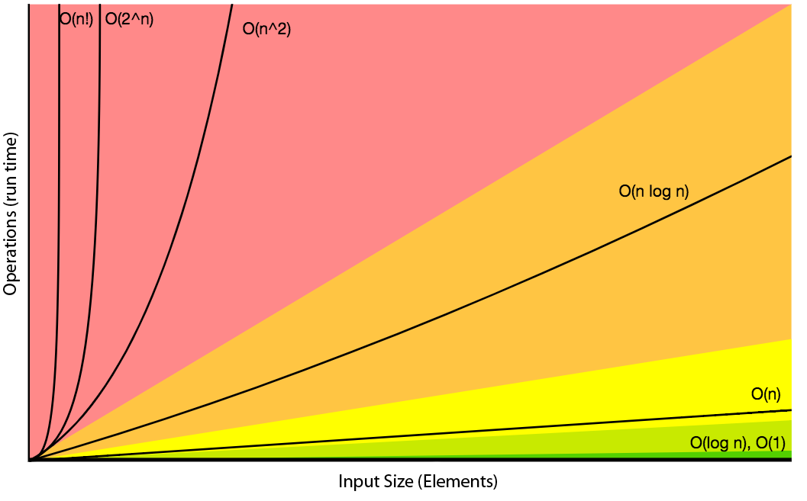
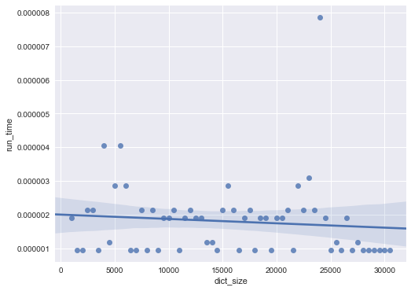
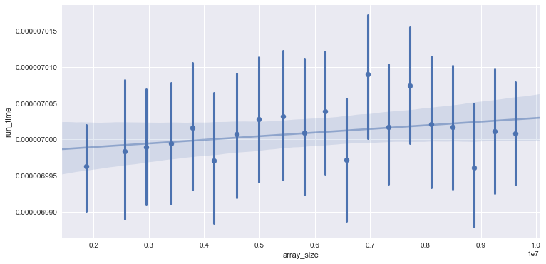

In this series of posts we’ll cover important concepts from computability theory; techniques for designing efficient algorithms for combinatorial, algebraic, and (if I can learn enough about it), number-theoretic problems. It’ll serve as a compact way to familiarize ourselves with basic concepts such as NP-Completeness from computational complexity theory, through Python.



The only pre-requisite is that you know what Big-O notation is conceptually, even if you don’t have a good intuition for why certain algorithms are one complexity versus another. Basically know that it is a relative representation of the complexity of an algorithm. More specifically, the order of growth in the time of execution depending on the length of the input.

# Constant Time O(1)
Constant time algoritms are described as O(1) in big-o notation. These algorithms will always execute at some fixed time regardless of the size of the input. Examples:

Looking up a value by key in a dictionary - Primary keys in dictionaries must be unique. Retrieving the value associated with a key is just a hash lookup, which is a very efficient algorithm to look up items. Python's dictionary is a hash table implementation of [collections.abc.Mapping](https://docs.python.org/3/library/collections.abc.html#collections.abc.Mapping). Methods like xxHash approach working speeds close to RAM limits.  See [here](https://softwareengineering.stackexchange.com/questions/49550/which-hashing-algorithm-is-best-for-uniqueness-and-speed) a great hashing comparison.
Finding the middle number of a list - The length of the list doesn't matter as addtion and division are very optimized compute methods.
More on the complexity of Python operations [here](https://wiki.python.org/moin/TimeComplexity)

```python
import matplotlib.pyplot as pyplot
import numpy as np
import seaborn as sns
import random, string, time
import pandas as pd
import cProfile 
from pyprof2calltree import convert, visualize
%matplotlib inline # for Jupyter notebook
```

## Creating our list of dictionaries
Note these are random but not truly unique keys, a collision could occur. Let's pretend they are unique for the purposes of this demonstration. Below will we create our list of dictionaries that increase in size. These dictionaries will have random string keys and numerical values.

```python
list_of_dicts = []
for i in range (1000, 31000, 500):
    rand_dict = {k: random.randint(90000,99999) for k in\
                 [''.join(random.choice(string.ascii_lowercase) for letter in range(5)) for word in range(1,i)]}
    list_of_dicts.append(rand_dict)
```
Our dictionaries will look like this

```python
{'abgri': 90714,
 'adnju': 94406,
 'adrki': 96192,
 'aesht': 90393,
 'aetfr': 95122,
 'afrql': 91921,
 'aifsv': 92711,
 'aihab': 91017,
 ...
```
## Searching through each dictionary
Now we are going to time the simple look up of the string galqe across each of our dictionaries.

```python
times = []
for dictionary in enumerate(list_of_dicts):
    start = time.time()  
    if 'galqe' in dictionary[1]:
        state= True
    else:
        state= False
    end = time.time()
    times.append(end - start)
    print('Dictionary {} :'.format(dictionary[0]+1), state, '  |  Search Time: {}'.format(end - start))
print("")
print('Variance of Search Time across all dictionaries:', format(np.var(times), '.20f'))
```


```bash
Dictionary 1 : False   |  Search Time: 1.9073486328125e-06
Dictionary 2 : False   |  Search Time: 9.5367431640625e-07
Dictionary 3 : False   |  Search Time: 9.5367431640625e-07
Dictionary 4 : False   |  Search Time: 2.1457672119140625e-06
Dictionary 5 : False   |  Search Time: 2.1457672119140625e-06
Dictionary 6 : False   |  Search Time: 9.5367431640625e-07
Dictionary 7 : False   |  Search Time: 4.0531158447265625e-06
Dictionary 8 : False   |  Search Time: 1.1920928955078125e-06
Dictionary 9 : False   |  Search Time: 2.86102294921875e-06
Dictionary 10 : False   |  Search Time: 4.0531158447265625e-06
Dictionary 11 : True   |  Search Time: 2.86102294921875e-06
Dictionary 12 : False   |  Search Time: 9.5367431640625e-07
Dictionary 13 : False   |  Search Time: 9.5367431640625e-07
Dictionary 14 : False   |  Search Time: 2.1457672119140625e-06
Dictionary 15 : False   |  Search Time: 9.5367431640625e-07
Dictionary 16 : False   |  Search Time: 2.1457672119140625e-06
Dictionary 17 : False   |  Search Time: 9.5367431640625e-07
Dictionary 18 : False   |  Search Time: 1.9073486328125e-06
Dictionary 19 : False   |  Search Time: 1.9073486328125e-06
Dictionary 20 : False   |  Search Time: 2.1457672119140625e-06
Dictionary 21 : False   |  Search Time: 9.5367431640625e-07
Dictionary 22 : False   |  Search Time: 1.9073486328125e-06
Dictionary 23 : False   |  Search Time: 2.1457672119140625e-06
Dictionary 24 : False   |  Search Time: 1.9073486328125e-06
Dictionary 25 : False   |  Search Time: 1.9073486328125e-06
Dictionary 26 : False   |  Search Time: 1.1920928955078125e-06
Dictionary 27 : False   |  Search Time: 1.1920928955078125e-06
Dictionary 28 : False   |  Search Time: 9.5367431640625e-07
Dictionary 29 : False   |  Search Time: 2.1457672119140625e-06
Dictionary 30 : False   |  Search Time: 2.86102294921875e-06
Dictionary 31 : False   |  Search Time: 2.1457672119140625e-06
Dictionary 32 : False   |  Search Time: 9.5367431640625e-07
Dictionary 33 : False   |  Search Time: 1.9073486328125e-06
Dictionary 34 : False   |  Search Time: 2.1457672119140625e-06
Dictionary 35 : False   |  Search Time: 9.5367431640625e-07
Dictionary 36 : False   |  Search Time: 1.9073486328125e-06
Dictionary 37 : False   |  Search Time: 1.9073486328125e-06
Dictionary 38 : False   |  Search Time: 9.5367431640625e-07
Dictionary 39 : False   |  Search Time: 1.9073486328125e-06
Dictionary 40 : False   |  Search Time: 1.9073486328125e-06
Dictionary 41 : False   |  Search Time: 2.1457672119140625e-06
Dictionary 42 : False   |  Search Time: 9.5367431640625e-07
Dictionary 43 : False   |  Search Time: 2.86102294921875e-06
Dictionary 44 : False   |  Search Time: 2.1457672119140625e-06
Dictionary 45 : False   |  Search Time: 3.0994415283203125e-06
Dictionary 46 : False   |  Search Time: 2.1457672119140625e-06
Dictionary 47 : False   |  Search Time: 7.867813110351562e-06
Dictionary 48 : False   |  Search Time: 1.9073486328125e-06
Dictionary 49 : False   |  Search Time: 9.5367431640625e-07
Dictionary 50 : False   |  Search Time: 1.1920928955078125e-06
Dictionary 51 : False   |  Search Time: 9.5367431640625e-07
Dictionary 52 : False   |  Search Time: 1.9073486328125e-06
Dictionary 53 : False   |  Search Time: 9.5367431640625e-07
Dictionary 54 : False   |  Search Time: 1.1920928955078125e-06
Dictionary 55 : False   |  Search Time: 9.5367431640625e-07
Dictionary 56 : False   |  Search Time: 9.5367431640625e-07
Dictionary 57 : False   |  Search Time: 9.5367431640625e-07
Dictionary 58 : False   |  Search Time: 9.5367431640625e-07
Dictionary 59 : False   |  Search Time: 9.5367431640625e-07
Dictionary 60 : False   |  Search Time: 9.5367431640625e-07

Variance of Search Time across all dictionaries: 0.00000000000120588576
```
We got a hit on Dictionary 11. We will see some compute time variance as millisecond-level timing is difficult in a real-world OS environment. Our computers are never really "doing nothing", it is still switching tasks, doing background jobs, etc.

## Plotting the results

```python
dict_results_df = pd.DataFrame({'run_time': times, 'dict_size': list(range (1000, 31000, 500))})

sns.set(rc={'figure.figsize':(8,6)})
sns.regplot(x='dict_size', y='run_time', data=dict_results_df);

```



# Linear time O(N)
In this class of algorithms the run time scales linearly in response to the input size (N). In the previous O(1) example we saw the fast hash table implementation look-up in Python dictionaries. This implementation was significantly faster than a rote search over a list (even if all elements fit in memory). You can examine the complexity across all python data containers [here](https://wiki.python.org/moin/TimeComplexity)

Let's use NumPy for a more relevant example of linear time.

numpy.zeros is O(n) as it initializes every element in the array to 0. Even though numpy uses comparatively very fast contiguous c-array when compared to a standard python list, the time complexity is still linear.

## Creating our array creation routine functions & removing outliers
As we've gone over before, there is some practical time inconsistency that we want to smooth out for demonstrative plotting purposes.
```python
range_spec = list(range(1000, 10001000, 500))
def arr_create_routines(range_spec, npfunc = np.zeros):
    list_of_times = []
    for i in range_spec:
        start = time.time()
        zero_array = npfunc(i)
        end = time.time()
        list_of_times.append(end - start)
    return list_of_times

def remove_outliers(df_in, col_name):
    q1 = df_in[col_name].quantile(0.25)
    q3 = df_in[col_name].quantile(0.75)
    iqr = q3-q1 #Interquartile range
    fence_low  = q1-1.5*iqr
    fence_high = q3+1.5*iqr
    df_out = df_in.loc[(df_in[col_name] > fence_low) & (df_in[col_name] < fence_high)]
    return df_out
```
## Plotting Results

```python
zeros_results_df = pd.DataFrame({'run_time': arr_create_routines(range_spec), 'array_size': range_spec})
zeros_results_df = remove_outliers(zeros_results_df, 'run_time')

sns.set(rc={'figure.figsize':(12,6)})
sns.regplot(x='array_size', y='run_time', data=zeros_results_df,
            x_bins=20,scatter_kws={"alpha":1},line_kws={"alpha":0.5});
```



This makes me curious if numpy.empty is any faster as it should only be allocating memory, this becomming O(1). Speed differences can be attributed to [malloc+memset being slower than calloc in the underlying C implementation](https://stackoverflow.com/questions/27464039/why-the-performance-difference-between-numpy-zeros-and-numpy-zeros-like)

```python
empty_results_df = pd.DataFrame({'run_time': arr_create_routines(range_spec,npfunc=np.empty), 'array_size': range_spec})
empty_results_df = remove_outliers(empty_results_df, 'run_time')

sns.set(rc={'figure.figsize':(12,6)})
sns.regplot(x='array_size', y='run_time', data=empty_results_df,color="seagreen",
            x_bins=20,scatter_kws={"alpha":1},line_kws={"alpha":0.5});

```


# O(N<sup>2</sup>) Quadratic Time

Quadratic time is common with algorithms that involve nested iterations over the data set. Deeper nested iterations will result in O(N<sup>2</sup>), O(N<sup>4</sup>) etc.This also includes simple sorting algorithms, such as bubble sort, selection sort, and insertion sort. Let's time a function that iterates over a list of integers to create a new list of the sum of i,j elements.

```python
range_spec = list(range(100, 1000, 10))

def add_each_element_nested(range_spec):
    list_of_times = []
    
    for routine in range_spec:
        iter_list = list(range(routine)) # range is an iter in python3
        start = time.time()
        new_list = []
        for i in iter_list:
            for j in iter_list:
                new_list.append(i + j)
        end = time.time()
        
        list_of_times.append(end - start)
    return list_of_times

x = pd.DataFrame({'run_time': add_each_element_nested(range_spec), 'array_size': range_spec})
# x = remove_outliers(zeros_results_df, 'run_time')

sns.set(rc={'figure.figsize':(7,7)})
sns.regplot(x='array_size', y='run_time', data=x,
           scatter_kws={"alpha":.5},line_kws={"alpha":0.8},
           lowess = True)
```


# O(c<sup>N</sup>) where <i>c>1</i> Exponential Time
We just covered O(N<sup>x</sup>) which is intuitive as you can easily picture the complexity tied to the number of x nested for loops. O(logn), which we will discuss later, is also intuitive as it splits the dataset in half everytime, such as binary search. I find O(2<sup>n</sup>) a little harder to understand. We know that the operation runs in exponential time, and that means it is impractical for any reasonably large input size n. Factorial combinatorics is a great general example as an arrangement of 10 characters has 3.6M candidates (10!) and adding only 1 letter, which represents a 10% increase in data size, increases the number of potential candidates by 11 (1000% increase). It is hard to imagine an algorithm where one additional data element can more than double the complexity. I found Towers of Hanoi to be one simple example, which is covered nicely by Brad Miller and David Ranum [here](http://interactivepython.org/runestone/static/pythonds/Recursion/TowerofHanoi.html). 

We'll work through an interactive example and graph the performance with [pyprof2calltree](https://github.com/pwaller/pyprof2calltree) in part 2 of this blog post.