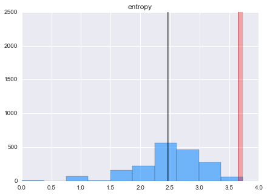

The intent of this post is to generally explore information entropy applied to a toy problem in network security. I'll outline a common problem then the basic concepts of entropy to then show a practical implementation using the the Kullback-Leibler divergence and the Python data stack.

In network security the latest malware botnet threat paradigm utilizes peer-to-peer (P2P) communication methods and domain generating algorithms (DGAs). This method avoids any single point of failure and evades many countermeasures as the command and control framework is embedded in the botnets themselves instead of the outdated paradigm of relying on external servers. 

A potential method of minimizing the impact of these threats is imploying a profiler that detects attributes consistent with DGA and P2P.

## Defining Entropy

Entropy is the average amount or expectation of information gained for each possible event $X_i$ with possibility $P(X_i)$ that is represented by $log_2 (1/P(X_i))$ bits: $$H(X)=\sum_{j=1}^n P(X_j) \log_2 (1/P(X_j))=-\sum_{j=1}^n P(X_j) \log_2 P(X_j)$$
where $H(X)$ is the entropy of events (i.e., random variable) $X$. Entropy is the amount of uncertainty or degree of surprise in an information system, thus low probability leads to high amount of information. Consider two events probabilities $p$ and $1-p$. The average information (per symbol or event) is:

$$H(X)=-p log_2p-(1-p)log_2 (1-p)$$

Entropy is at it's greatest when all events/outcomes are equally likely to occur.

* High entropy means $X$ is from a uniform distribution, where every outcome is as likely to occur
    
* Low entropy means $X$ is from varied distribution (with various peaks and valleys)
 
Claude E. Shannon's outlined methods of estimating the entropy of English in his paper <a href ="https://www.princeton.edu/~wbialek/rome/refs/shannon_51.pdf"> "Prediction and Entropy of Printed English"</a>. He states that constraints imposed on the text of English language decrease in its overall entropy. Constraints such as 'q' must always be followed by 'u and other rules such as "i before e except after c" are dependencies that make the English language more redundant. This redundancy is beneficial when discerning a signal from noise. If you read "John is embroiled in a legal qxxxdary" you could quickly infer 'uan' as the missing letters. W 

For the toy problem outlined above, we can calculate the entropy of English using N-grams by statistically calculating the entropy of the next letter when the previous N - 1 letters are known. The entropy approaches H (entropy of English) as N increases.

[This video](https://www.youtube.com/watch?v=R4OlXb9aTvQ&t) is my favorite intuitive explanation of Information Entropy.

```python
import pandas as pd
import numpy as np
import seaborn as sns
%pylab inline
```

As I build the model I'll start with a 2k row subset of Alexa's top 1,000,000 sites world wide. I will utilize the full dataset at the end.

In bash:
```shell
# Create subset file
head -n 2000 top1m.csv > top2k.csv
# If we wanted to add a header before hand
sed -i 1i"rank,url" top2k.csv

```
OR use *nrows=20* parameter in read_csv


```python
alexadf = pd.read_csv('top2k.csv',names=['uri'],usecols= [1],header=None,encoding='utf-8')
alexadf.head(2)
```


<div style="max-height:1000px;max-width:1500px;overflow:auto;">
<table border="1" class="dataframe">
  <thead>
    <tr style="text-align: right;">
      <th></th>
      <th>uri</th>
    </tr>
  </thead>
  <tbody>
    <tr>
      <th>0</th>
      <td>   google.com</td>
    </tr>
    <tr>
      <th>1</th>
      <td> facebook.com</td>
    </tr>
  </tbody>
</table>
<p>2 rows × 1 columns</p>
</div>


In the name www.google.com, the TLD (top-level domain) is the dot(.) and the proceeding *com*. for complex domain-names using com.cn and .com.tw, the text after the last dot is the TLD. For this simple first pass model we won't weigh or penalize domain names belonging to less trusted countries/regions. We also won't consider cobinations of sub-domains.

## "Normal" domain names
To start we'll need to extract all domain names before the first  '.' then drop NA and duplicates from the dataframe. We can check for duplicates by comparing the len() to nunique().


```python
alexadf['uri'] = alexadf['uri'].apply(lambda x: x[:x.find('.')]).astype(str)
alexadf = alexadf.dropna()
alexadf = alexadf.drop_duplicates()
alexadf['label'] = 0 # Create label identifying values as nominal
alexadf.head(2)
```


<div style="max-height:1000px;max-width:1500px;overflow:auto;">
<table border="1" class="dataframe">
  <thead>
    <tr style="text-align: right;">
      <th></th>
      <th>uri</th>
      <th>label</th>
    </tr>
  </thead>
  <tbody>
    <tr>
      <th>0</th>
      <td>   google</td>
      <td> 0</td>
    </tr>
    <tr>
      <th>1</th>
      <td> facebook</td>
      <td> 0</td>
    </tr>
  </tbody>
</table>
<p>2 rows × 2 columns</p>
</div>


## "Abnormal" domain names
We can acquire a list of known suspicious domains here: https://isc.sans.edu/suspicious_domains.html
to start we'll use the 'High Sensitivity Level' file. These domain names are probably not as sophisticated as those created by something like *Kwyjibo* http://dl.acm.org/citation.cfm?id=1455471 and more in line with domains generated by Conficker and Kraken.


```python
malicious_domains = pd.read_csv('suspiciousdomains_High.txt',encoding='utf-8',skiprows=17,header=None,nrows=2200)
malicious_domains.columns = ['uri']
malicious_domains['uri'] = malicious_domains['uri'].apply(lambda x: x[:x.find('.')]).astype(str)

malicious_domains.dropna()
malicious_domains.drop_duplicates()

malicious_domains['label'] = 1

malicious_domains.head(2)
#malicious_domains.info()
```


<div style="max-height:1000px;max-width:1500px;overflow:auto;">
<table border="1" class="dataframe">
  <thead>
    <tr style="text-align: right;">
      <th></th>
      <th>uri</th>
      <th>label</th>
    </tr>
  </thead>
  <tbody>
    <tr>
      <th>0</th>
      <td> 000007</td>
      <td> 1</td>
    </tr>
    <tr>
      <th>1</th>
      <td>  000cc</td>
      <td> 1</td>
    </tr>
  </tbody>
</table>
<p>2 rows × 2 columns</p>
</div>


Concatenate normal and dga dataframes into one dataframe and create a label column:


```python
df = pd.concat([alexadf, malicious_domains], ignore_index=True)
df['length'] = [len(x) for x in df['uri']]

df.head(2)
```


<div style="max-height:1000px;max-width:1500px;overflow:auto;">
<table border="1" class="dataframe">
  <thead>
    <tr style="text-align: right;">
      <th></th>
      <th>uri</th>
      <th>label</th>
      <th>length</th>
    </tr>
  </thead>
  <tbody>
    <tr>
      <th>0</th>
      <td>   google</td>
      <td> 0</td>
      <td> 6</td>
    </tr>
    <tr>
      <th>1</th>
      <td> facebook</td>
      <td> 0</td>
      <td> 8</td>
    </tr>
  </tbody>
</table>
<p>2 rows × 3 columns</p>
</div>


We'll implement Entropy defined as $H(X)=\sum_{j=1}^n P(X_j) \log_2 (1/P(X_j))=-\sum_{j=1}^n P(X_j) \log_2 P(X_j)$ (same as above) using the Counter dict subclass that counts hashable objects. It is an unordered collection where elements are stored as dict keys and corresponding counts are stored as dict values. Counts are allowed to be any int value including zero or negative counts. This class is similar to 'bags' in C++. 


```python
from collections import Counter
# Remember mixed standard python functions and numpy functions are very slow 
def calcEntropy(x):
    p, lens = Counter(x), np.float(len(x))
    return -np.sum( count/lens * np.log2(count/lens) for count in p.values())
```

Let's take a look at the top 5 entropy values:


```python
df['entropy'] = [calcEntropy(x) for x in df['uri']]
df.sort('entropy', ascending = False)[:5]
```


<div style="max-height:1000px;max-width:1500px;overflow:auto;">
<table border="1" class="dataframe">
  <thead>
    <tr style="text-align: right;">
      <th></th>
      <th>uri</th>
      <th>label</th>
      <th>length</th>
      <th>entropy</th>
    </tr>
  </thead>
  <tbody>
    <tr>
      <th>2582</th>
      <td> cg79wo20kl92doowfn01oqpo9mdieowv5tyj</td>
      <td> 1</td>
      <td> 36</td>
      <td> 4.308271</td>
    </tr>
    <tr>
      <th>3506</th>
      <td>         hfoajof1ornmzmasvuqiowdpchap</td>
      <td> 1</td>
      <td> 28</td>
      <td> 4.066109</td>
    </tr>
    <tr>
      <th>2718</th>
      <td>              crovniedelamjdusaboye73</td>
      <td> 1</td>
      <td> 23</td>
      <td> 4.055958</td>
    </tr>
    <tr>
      <th>2576</th>
      <td>              cerovskiprijatnomnebi25</td>
      <td> 1</td>
      <td> 23</td>
      <td> 3.969002</td>
    </tr>
    <tr>
      <th>3278</th>
      <td>                 gesticulez-rondkijkt</td>
      <td> 1</td>
      <td> 20</td>
      <td> 3.921928</td>
    </tr>
  </tbody>
</table>
<p>5 rows × 4 columns</p>
</div>


We can see that the length and entropy of domains of label 1 (randomly generated) are higher. 

We can use the Pearson's coefficient to quantify the association between two variables that are assumed to be from a Gaussian distribution. The underlying distribution of length and entropy could be power or box-cox transformed to meet the assumption of normality, but knowing that the measures are linear (not monotonic) will be good enough for now. Let's try Spearman's coefficient just to compare the difference between coefficients.


```python
from scipy import stats
#plt.rcParams['figure.figsize'] = 13, 7
sns.set_context(rc={"figure.figsize": (7, 5)})

g = sns.JointGrid(df.length.astype(float), df.entropy.astype(float))
g.plot(sns.regplot, sns.distplot, stats.spearmanr);

print "Pearson's r: {0}".format(stats.pearsonr(df.length.astype(float), df.entropy.astype(float)))
```

    Pearson's r: (0.80826357554406247, 0.0)


We can compare the distribution of entropy for normal vs malcious domains via histograms and parametric statistics. More robust non-parametric methods can be used for the next model iteration.


```python
sns.set_context(rc={"figure.figsize": (7, 5)})


dfNominal = df[df['label']== 0]
dfDGA = df[df['label']== 1]

def shadedHist(df,col,bins):
    df[col].hist(bins = bins, color = 'dodgerblue', alpha = .6, normed = False)
    len_mean = df[col].mean()
    len_std = df[col].std()
    # mpl
    plt.plot([len_mean, len_mean], [0,2500 ],'k-',lw=3,color = 'black',alpha = .4)
    plt.plot([len_mean + (2 * len_std), len_mean + (2 * len_std)], [0, 2500], 'k-', lw=2, color = 'red', alpha = .4)
    plt.axvspan(len_mean + (2 * len_std), max(df[col]), facecolor='r', alpha=0.3)
    plt.title(col)
```

Red highlighting is of values over 2 standard deviations from the mean:

**Nominal entropy distribution**


```python
sns.set_context(rc={"figure.figsize": (7, 5)})

shadedHist(df[df['label']== 0],'entropy',10) 

nominal_parametric_upper = dfNominal['entropy'].mean() + \
      2 * dfNominal['entropy'].std()
    
print nominal_parametric_upper
```

    3.66256510371





**Malicious entropy distribution**


```python
sns.set_context(rc={"figure.figsize": (7, 5)})

shadedHist(dfDGA,'entropy',10)
```


## When Entropy isn't enough

The differences based on entropy alone probably won't add enough distinguishing or predictive power in determining nominal vs DGA domains so let's try to engineer more features. Character n-grams avoid the use of tokenizers and are more language agnostic than word-grams, but they increase the dimensionality of the data.

We can utilize scikit-learn's CountVectorizer to tokenize and count the word occurrences of the nominal Alexa domain name corpus of text. We will tune the following parameters:

- The *min_df* parameter will disregard words which appear less than *min_df* fraction of reviews.

- The *ngram_range* sets the lower and upper boundary on the range of n-values for the n-grams to be extracted.

We calculated the upper entropy limit for Alexa values (label = 0) to be 3.66 bits so we'll set the range between 3 and 4.


```python
from sklearn.feature_extraction.text import CountVectorizer
cv = CountVectorizer(analyzer='char', ngram_range=(3,4))

cv_nominal = cv.fit_transform(df[df['label']== 0]['uri'])
cv_all     = cv.fit_transform(df['uri'])

feature_names = cv.get_feature_names()

import operator
sorted(cv.vocabulary_.iteritems(), key=operator.itemgetter(1), reverse= True)[0:5]
```

    [(u'zzzd', 22745),
     (u'zzz', 22744),
     (u'zzyt', 22743),
     (u'zzy', 22742),
     (u'zzpa', 22741)]


```python
dfConcat = pd.concat([df.ix[:, 2:4], pd.DataFrame(cv_all.toarray())], join='outer', axis=1, ignore_index=False)
dfConcat.head(3)
# cv.vocabulary_
# cv_nominal.toarray()
# cv.get_feature_names()
# cv.vocabulary_
```

<div style="max-height:1000px;max-width:1500px;overflow:auto;">
<table border="1" class="dataframe">
  <thead>
    <tr style="text-align: right;">
      <th></th>
      <th>length</th>
      <th>entropy</th>
      <th>0</th>
      <th>1</th>
      <th>2</th>
      <th>3</th>
      <th>4</th>
      <th>5</th>
      <th>6</th>
      <th>7</th>
      <th>8</th>
      <th>9</th>
      <th>10</th>
      <th>11</th>
      <th>12</th>
      <th>13</th>
      <th>14</th>
      <th>15</th>
      <th>16</th>
      <th>17</th>
      <th></th>
    </tr>
  </thead>
  <tbody>
    <tr>
      <th>0</th>
      <td> 6</td>
      <td> 1.918296</td>
      <td> 0</td>
      <td> 0</td>
      <td> 0</td>
      <td> 0</td>
      <td> 0</td>
      <td> 0</td>
      <td> 0</td>
      <td> 0</td>
      <td> 0</td>
      <td> 0</td>
      <td> 0</td>
      <td> 0</td>
      <td> 0</td>
      <td> 0</td>
      <td> 0</td>
      <td> 0</td>
      <td> 0</td>
      <td> 0</td>
      <td>...</td>
    </tr>
    <tr>
      <th>1</th>
      <td> 8</td>
      <td> 2.750000</td>
      <td> 0</td>
      <td> 0</td>
      <td> 0</td>
      <td> 0</td>
      <td> 0</td>
      <td> 0</td>
      <td> 0</td>
      <td> 0</td>
      <td> 0</td>
      <td> 0</td>
      <td> 0</td>
      <td> 0</td>
      <td> 0</td>
      <td> 0</td>
      <td> 0</td>
      <td> 0</td>
      <td> 0</td>
      <td> 0</td>
      <td>...</td>
    </tr>
    <tr>
      <th>2</th>
      <td> 7</td>
      <td> 2.521641</td>
      <td> 0</td>
      <td> 0</td>
      <td> 0</td>
      <td> 0</td>
      <td> 0</td>
      <td> 0</td>
      <td> 0</td>
      <td> 0</td>
      <td> 0</td>
      <td> 0</td>
      <td> 0</td>
      <td> 0</td>
      <td> 0</td>
      <td> 0</td>
      <td> 0</td>
      <td> 0</td>
      <td> 0</td>
      <td> 0</td>
      <td>...</td>
    </tr>
  </tbody>
</table>
<p>3 rows × 22748 columns</p>
</div>


```python
X = dfConcat.values
y = df.ix[:,1]
print X[0:3]
print ''
print y[0:3]
```

    [[ 6.          1.91829583  0.         ...,  0.          0.          0.        ]
     [ 8.          2.75        0.         ...,  0.          0.          0.        ]
     [ 7.          2.52164064  0.         ...,  0.          0.          0.        ]]
    
    0    0
    1    0
    2    0
    Name: label, dtype: int64


**Dummy Classifier**

Since we have a labeled dataset, we can conduct a sanity check by comparing any given selected estimator against the following rules of thumb for classfication:

- Stratified generates random predictions by respecting the training set’s class distribution
- Most_frequent always predicts the most frequent label in the training set
- Uniform generates predictions uniformly at random


```python
from sklearn.cross_validation import train_test_split 
X_train, X_test, y_train, y_test = train_test_split(X, y, random_state=22)
```


```python
from sklearn.dummy import DummyClassifier

for strategy in ['stratified', 'most_frequent', 'uniform']:
    clf = DummyClassifier(strategy=strategy,random_state=None)
    clf.fit(X_train, y_train)
    print strategy + ': ' + str(clf.score(X_test, y_test))
```

    stratified: 0.50049652433
    most_frequent: 0.547169811321
    uniform: 0.513406156902


**Random Forest**

We'll leave the parameter tuning via grid search, random search, or more <a href ="http://www.johnmyleswhite.com/notebook/2012/07/21/automatic-hyperparameter-tuning-methods/">advanced methods</a> to another time. For now let's see what an untuned Random Forest model yields.


```python
from sklearn.ensemble import RandomForestClassifier
from sklearn.cross_validation import cross_val_score
rf = RandomForestClassifier(n_jobs = -1)
rf.fit(X_train, y_train)
print 'RF' + ': ' + str(rf.score(X_test, y_test))
    
# scores = cross_val_score(clf, X, y, cv=2)
# print scores
```

    RF: 0.636544190665


The results show that an un-tuned Random Forest classifier does better than the dummy classifier which is good considering the intentional near 50/50 split of nominal and DGA domains in our dataset.

**Adding word-grams from an English dictionary**

Let's utilize Unix's built in words list to create a dataframe of english words that we will then use to create character n-grams. We will then compare this result to the nominal and malicious domain names to compute how many real english n-grams exist in any given domain name. For example we'd expect a domain name like 

```shell
> cat /usr/share/dict/words > eng_words.txt

# Check file size
> du -skh words.txt 
2.4M

#Count words in file
> wc -l eng_words.txt
235886 eng_words.txt
```


```python
dfEng = pd.read_csv('eng_words.txt', names=['word'],
                    header=None, dtype={'word': np.str},
                    encoding='utf-8')

# Convert all words to lowercase to match domain name dataframes
dfEng['word'] = dfEng['word'].map(lambda x: np.str(x).strip().lower())
dfEng['word'].drop_duplicates(inplace=True)
dfEng['word'].dropna(inplace=True)

dfEng[10:15]
```


<div style="max-height:1000px;max-width:1500px;overflow:auto;">
<table border="1" class="dataframe">
  <thead>
    <tr style="text-align: right;">
      <th></th>
      <th>word</th>
    </tr>
  </thead>
  <tbody>
    <tr>
      <th>10</th>
      <td>   aaronic</td>
    </tr>
    <tr>
      <th>11</th>
      <td> aaronical</td>
    </tr>
    <tr>
      <th>12</th>
      <td>  aaronite</td>
    </tr>
    <tr>
      <th>13</th>
      <td> aaronitic</td>
    </tr>
    <tr>
      <th>14</th>
      <td>      aaru</td>
    </tr>
  </tbody>
</table>
<p>5 rows × 1 columns</p>
</div>


```python
from sklearn.feature_extraction.text import CountVectorizer

cvEng = CountVectorizer(analyzer='char', ngram_range=(3,4))

cvEngfeatures = cvEng.fit_transform(dfEng['word'])

import operator
print sorted(cvEng.vocabulary_.iteritems(), key=operator.itemgetter(1), reverse= True)[0:5]
```

    [(u'zzy', 65452), (u'zzwi', 65451), (u'zzw', 65450), (u'zzuo', 65449), (u'zzu', 65448)]


```python
cvEngfeatures
```


    <234371x65453 sparse matrix of type '<type 'numpy.int64'>'
    	with 3320438 stored elements in Compressed Sparse Column format>


```python
def engDictMatch(x):
    return str(np.log10(cvEngfeatures.sum(axis=0).getA1()) * cvEng.transform([x]).T)
print 'English dictionary match: ' + str(engDictMatch('yahoo')) 
print 'English dictionary match: ' + str(engDictMatch('drudgereport')) 
print 'English dictionary match: ' + str(engDictMatch('32tsdgseg')) 
```

    English dictionary match: [ 7.95517524]
    English dictionary match: [ 44.05504246]
    English dictionary match: [ 2.58433122]


Let's evaluate this match function using the original df (before countvectorizer and dfConcat steps):


```python
df['dictMatch'] = np.log10(cvEngfeatures.sum(axis=0).getA1()) * cvEng.transform(df['uri']).T 
# df['dictMatch'] = df['uri'].apply(lambda x: engDictMatch(x))
df.head(3)
```


<div style="max-height:1000px;max-width:1500px;overflow:auto;">
<table border="1" class="dataframe">
  <thead>
    <tr style="text-align: right;">
      <th></th>
      <th>uri</th>
      <th>label</th>
      <th>length</th>
      <th>entropy</th>
      <th>dictMatch</th>
    </tr>
  </thead>
  <tbody>
    <tr>
      <th>0</th>
      <td>   google</td>
      <td> 0</td>
      <td> 6</td>
      <td> 1.918296</td>
      <td> 11.885770</td>
    </tr>
    <tr>
      <th>1</th>
      <td> facebook</td>
      <td> 0</td>
      <td> 8</td>
      <td> 2.750000</td>
      <td> 22.813645</td>
    </tr>
    <tr>
      <th>2</th>
      <td>  youtube</td>
      <td> 0</td>
      <td> 7</td>
      <td> 2.521641</td>
      <td> 16.048996</td>
    </tr>
  </tbody>
</table>
<p>3 rows × 5 columns</p>
</div>


**Second Pass**

Let's examine what effect this additional feature has on our predictive accuracy by recreating our training and test set and rerunning classification:


```python
dfConcat2 = pd.concat([pd.DataFrame(df.ix[:,4]),dfConcat],join='outer', axis=1, ignore_index=False)
X = dfConcat2.values
y = df.ix[:,1]

X_train, X_test, y_train, y_test = train_test_split(X, y, random_state=None)

rf = RandomForestClassifier(n_jobs = -1)
rf.fit(X_train, y_train)
print 'RF' + ': ' + str(rf.score(X_test, y_test))
```

    RF: 0.722502482622


This new feature has added a small amount of power, but we could potentially gain much more by selecting our n-grams, thresholds, and other CountVectorizer parameters more intelligently. We could also create other features based on simple pattern matching concepts such as penalizing URIs if they contain more than 4 of the same character in a row. 

```python
import re

pattern = 'ZZZ'
n = re.findall(pattern, string)
# OR we can use str.count
```
