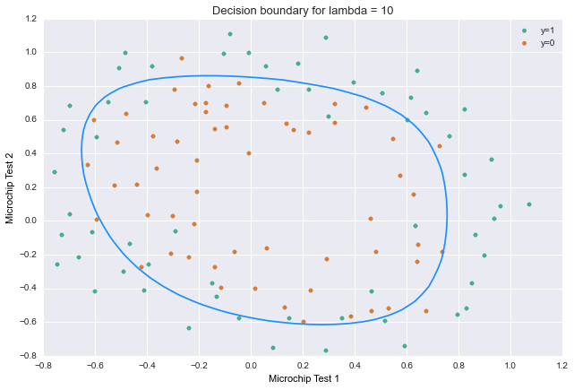
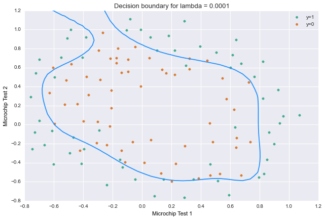
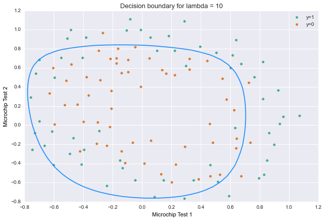

```python
import numpy as np
import matplotlib.pyplot as plt
from scipy import optimize
import pandas as pd
import seaborn as sns
from ggplot import *
%matplotlib inline
```
## Loading the data

```python
# Load training data
data = pd.read_csv('ex2data2.txt',header=None, names = ('x1','x2','y'))
data.info()
```

    <class 'pandas.core.frame.DataFrame'>
    Int64Index: 118 entries, 0 to 117
    Data columns (total 3 columns):
    x1    118 non-null float64
    x2    118 non-null float64
    y     118 non-null int64
    dtypes: float64(2), int64(1)
    memory usage: 3.7 KB

Columns 1 & 2 are the training data, 3 is the label set.


```python
data.head(2)
```
<div style="max-height:1000px;max-width:1500px;overflow:auto;">
<table border="1" class="dataframe">
  <thead>
    <tr style="text-align: right;">
      <th></th>
      <th>x1</th>
      <th>x2</th>
      <th>y</th>
    </tr>
  </thead>
  <tbody>
    <tr>
      <th>0</th>
      <td> 0.051267</td>
      <td> 0.69956</td>
      <td> 1</td>
    </tr>
    <tr>
      <th>1</th>
      <td>-0.092742</td>
      <td> 0.68494</td>
      <td> 1</td>
    </tr>
  </tbody>
</table>
</div>


```python
# Get the df values into numpy arrays
X = data.ix[:,0:2].values
y = data.ix[:,2].values
y = y[:, None]
```

## Visualizing the data
On almost every release Pandas adds more and more helpful plot methods that help you avoid specifying your plot in matplot directly. These functions are very handy for exploration. I still find myself reaching for ggplot though, perhaps it's because I started in R years ago, or maybe it's because I subscribed to some of the concepts in Wilkinson's [The Grammar of Graphics]( http://www.amazon.com/The-Grammar-Graphics-Statistics-Computing/dp/0387245448). 

```python
data.plot(kind='scatter', x=0, y=1, c = 2, s=40, title='Microchip Test 1 & 2',
          figsize=None, legend= True)
# pd.scatter_matrix(data, alpha=0.2, figsize=(6, 6), diagonal='kde')
```


Here's another quick plot with the excellent seaborn package. The syntax is arbitrary across the various plot types unlike ggplot, but it's constantly improving.


```python
sns.lmplot('x1', 'x2', hue='y', data=data, fit_reg=False)
```


One more take with ggplot. If anyone reading this knows a smarter way of adjusting the plot size please let me know.

```python
ggplot(data ,aes(x='x1', y='x2', color='y')) +\
    geom_point(alpha=.7, size = 30) +\
    theme_matplotlib(rc={"figure.figsize": "5, 5"})
```


As we stated before we'll use logistic regression for binary classification. This means we'll be taking a continuous range of input and convert it to either 0 or 1 based on it's range:<br>

$h_\theta(x)$ = our Logistic Regression function.<br>
If the output of $h_\theta(x)\geq .5$, then 1<br>
If the output of $h_\theta(x)\lt .5$, then 0<br>

Recall that we'll have a vector of coefficients $\theta$ that we chose to get us as close to y (our labels) as possible, that is to say choose $\theta_0$, $\theta_1$, $\theta_2$ (assuming we only have three coefficients) that minimize the sum of the squared differences (squared error).


<br>
So it's a clean linear algebra process of: **Prediction = Data * Parameters**

Now we'll take our data and process it through the sigmoid function:
$$h_\theta(x) = g(\theta^Tx): g(z) = \frac{1}{1+e^{-z}}$$

The logistic regression cost function including regularization (last term) is:

$$J(\theta) = \frac{1}{m}\sum\limits_{i=1}^{m} [-y^{(i)}log(h_\theta(x^{(i)})-(1 - y^{(i)})log(1 - h_\theta(x^{(i)}))]+\frac{\lambda}{2m}\sum\limits_{j=1}^{n}\theta^2_j$$

The gradient of the cost including regularization is:

$$\frac{\partial{J(\theta)}}{\partial{\theta_j}} = \frac{1}{m}\sum\limits_{i=1}^{m} (h_\theta(x^{(i)}) - y^{(i)})x_j^{(i)}     \qquad \qquad \qquad   for \,\, j=0 $$

$$\frac{\partial{J(\theta)}}{\partial{\theta_j}} = (\frac{1}{m}\sum\limits_{i=1}^{m} (h_\theta(x^{(i)}) - y^{(i)})x_j^{(i)}) + \frac{\lambda}{m}\theta_j    \qquad    for \,\, j \geq 1 $$


## Feature Engineering:
We can tell from the two-dimensional plots above that we have non-linearly separable data. We might want to start with seeing what kind of boundaries we can train using interactions between the two variables in our feature space. Since we're using logistic regression we'll need to manually construct these new features. This is not the case with more advanced non-linear methods such as SVMs with a Gaussian or polynomial kernel as the various interactions between the input variables are inherently captured by the structure of the model.

Remember that depending on the scale of the new features we create (f.g. X1, X2, X1^2, X2^2, X1\*X2, X1\*X2^2), we might need to scale down variables to speed up convergence of the gradient descent. Logistic Regression, like SVMs can also suffer poor performance if some input variables have a larger range of values compared to others. Normalization is used to address this: http://scikit-learn.org/stable/modules/classes.html#module-sklearn.preprocessing.


```python
def new_features(X1, X2, degree=18):
    """
    Returns a m x n matrix of the original inputs along with new columns based on their exponents and combinations.
    Args:
        x1, x2: 2D arrays (floats) with identical shapes
        highest_poly_degree: int to specify the max polynomial
    """    
    num_features = (degree + 1) * (degree + 2) / 2
    out = np.empty(shape=(X1.shape[0], num_features), dtype=float)
    k = 0
    for i in xrange(0, degree + 1):
        for j in xrange(i + 1):
            new_feature_values = X1**(i - j) * X2**j
            out[:, k] = new_feature_values[:, 0]
            k += 1
    return out

X = new_features(X[:, 0][:, None], X[:, 1][:, None])
```

$g(z) = \frac{1}{1+e^{-z}}$ expressed as:


```python
def sigmoid(z):
    """
    Return Sigmoid of z
    Args:
        Z : array or scalar
    """
    return 1.0 / (1.0 + np.exp(-z))
```

Usually we'd want to use a package function. Notice above that we are using numpy's exp and not the math library's exp. There is a common performance hit in Python code of accidentally bouncing back and forth between NumPy and standard functions which are not optimized for the contiguous C arrays of NumPy. 

Below we are using SciPy's expit over scipy.stats.logistic.cdf because it is the source operator and not a wrapper function with extra parameters like logistic.cdf. Note the 4x speedup between our manual and SciPy function.

```python
from scipy.special import expit
```

```python
%%timeit 

expit(X[1])
```

`100000 loops, best of 3: 3 µs per loop`

```python
%%timeit

sigmoid(X[1])
```

`100000 loops, best of 3: 6.69 µs per loop`

$g(\theta^Tx)$ expressed as:

```python
def h_of_theta(theta, X):
    transposed_theta = theta[:, None]
    return sigmoid(X.dot(transposed_theta))
```

$J(\theta) = \frac{1}{m}\sum\limits_{i=1}^{m} [-y^{(i)}log(h_\theta(x^{(i)})-(1 - y^{(i)})log(1 - h_\theta(x^{(i)}))]+\frac{\lambda}{2m}\sum\limits_{j=1}^{n}\theta^2_j$ <br>

Recall that the $\frac{\lambda}{2m}\sum\limits_{j=1}^{n}\theta^2_j$ at the end of the line above is the regularization term.<br>
expressed as:

```python
def cost_function_reg(theta, X, y, lamda):
    """
    Return cost of given theta for logistic regression
    Args:
        theta is a 1D numpy array 
        X is a m x n numpy array w/ the first column being an intercept of 1
        y is a m x 1 numpy array, it is the label set for each obs in X
        lambda : float is regularization parameter
    """
    m = len(y) * 1.0
    h_theta = h_of_theta(theta, X)


    tol = .00000000000000000000001  
    h_theta[h_theta < tol] = tol  # values close to zero are set to tol
    h_theta[(h_theta < 1 + tol) & (h_theta > 1 - tol)] = 1 - tol  # values close to 1 get set to 1 - tol

    regularization_term = (float(lamda)/2) * theta**2
    cost_vector = y * np.log(h_theta) + (-y + 1) * np.log(-h_theta + 1)

    J = -sum(cost_vector)/m + sum(regularization_term[1:])/m

    return J[0]
```

$\frac{\partial{J(\theta)}}{\partial{\theta_j}} = \frac{1}{m}\sum\limits_{i=1}^{m} (h_\theta(x^{(i)}) - y^{(i)})x_j^{(i)}     \qquad \qquad \qquad   for \,\, j=0 $

$\frac{\partial{J(\theta)}}{\partial{\theta_j}} = (\frac{1}{m}\sum\limits_{i=1}^{m} (h_\theta(x^{(i)}) - y^{(i)})x_j^{(i)}) + \frac{\lambda}{m}\theta_j    \qquad    for \,\, j \geq 1 $ expressed as:


```python
def gradient(theta, X, y, lamda):
    """
    Return gradient of theta 
    Args:
        theta is a 1D numpy array 
        X is a m x n numpy array w/ the first column being an intercept of 1
        y is a m x 1 numpy array, it is the label set for each obs in X
        lambda : float is regularization parameter
    """
    m = len(y)
    h_theta = h_of_theta(theta, X)
    derivative_regularization_term = float(lamda) * theta/m
    grad = (h_theta - y).T.dot(X)/m + derivative_regularization_term.T
    grad[0][0] -= derivative_regularization_term[0]  
    
    return np.ndarray.flatten(grad)  
```

Let's see what we have so far and test one iteration of regularized logistic regression at initial theta.


```python
m, n = X.shape
initial_theta = np.zeros(n)
lambda2 = 1

cost = cost_function_reg(initial_theta, X, y, lambda2)
grad = gradient(initial_theta, X, y, lambda2)

print 'Training set size:', X.shape
print ''
print 'Cost at initial theta of zeros:', cost
print '\nGradient at initial theta (zeros):\n'
print grad
```

    Training set size: (118, 190)
    
    Cost at initial theta of zeros: 0.69314718056
    
    Gradient at initial theta (zeros):
    
    [  8.47457627e-03   1.87880932e-02   7.77711864e-05   5.03446395e-02
       1.15013308e-02   3.76648474e-02   1.83559872e-02   7.32393391e-03
       8.19244468e-03   2.34764889e-02   3.93486234e-02   2.23923907e-03
       1.28600503e-02   3.09593720e-03   3.93028171e-02   1.99707467e-02
       4.32983232e-03   3.38643902e-03   5.83822078e-03   4.47629067e-03
       3.10079849e-02   3.10312442e-02   1.09740238e-03   6.31570797e-03
       4.08503006e-04   7.26504316e-03   1.37646175e-03   3.87936363e-02
       1.99427086e-02   2.74239681e-03   2.32500787e-03   2.21859968e-03
       1.37054473e-03   4.59059364e-03   2.44887343e-03   3.45775396e-02
       2.58470812e-02   9.24073316e-04   3.56449986e-03   2.36431492e-04
       2.73345994e-03   1.41372690e-04   5.06220460e-03   7.44299593e-04
       3.91158180e-02   1.94460178e-02   2.03971305e-03   1.67313910e-03
       9.57374855e-04   8.28510751e-04   1.45754709e-03   5.55440822e-04
       3.80878101e-03   1.42922173e-03   3.74400380e-02   2.27382094e-02
       1.00011095e-03   2.22706585e-03   1.51733578e-04   1.25745954e-03
       1.48580695e-04   1.57570852e-03   3.59508725e-06   3.99563605e-03
       5.22308844e-04   4.06790884e-02   1.90410565e-02   1.75081954e-03
       1.23641700e-03   4.69990556e-04   5.27414397e-04   5.55662823e-04
       3.40580487e-04   1.05188919e-03   1.97028168e-04   3.35794866e-03
       9.67859736e-04   4.06730521e-02   2.10163086e-02   1.15032574e-03
       1.49782866e-03   1.02669187e-04   6.64345919e-04   1.09951984e-04
       6.18955072e-04   7.43336884e-05   1.07123799e-03  -6.55122093e-05
       3.44743950e-03   5.15509782e-04   4.35307118e-02   1.89437400e-02
       1.66248899e-03   9.41574445e-04   2.61308468e-04   3.41532634e-04
       2.43492082e-04   2.14664106e-04   3.63362793e-04   1.41628227e-04
       8.21956083e-04   3.56919486e-05   3.11923871e-03   8.32085947e-04
       4.47399893e-02   2.02778726e-02   1.31985563e-03   1.06764143e-03
       7.86844535e-05   3.87047105e-04   6.94079048e-05   2.85477158e-04
       6.90699995e-05   3.69582263e-04   2.39341381e-05   8.16074446e-04
      -9.08769094e-05   3.17917837e-03   6.45964381e-04   4.77107504e-02
       1.92318272e-02   1.68027441e-03   7.40076535e-04   1.63801867e-04
       2.27678507e-04   1.19804339e-04   1.31380821e-04   1.46616000e-04
       9.85447536e-05   2.59049209e-04   4.94761874e-05   6.85844461e-04
      -3.01668071e-05   3.02344543e-03   9.01454727e-04   4.99273765e-02
       2.02879133e-02   1.49547626e-03   8.00908230e-04   6.71510752e-05
       2.41544808e-04   4.36257990e-05   1.48661051e-04   4.47256584e-05
       1.50975684e-04   3.97448551e-05   2.53079620e-04  -7.50732189e-06
       6.74686175e-04  -8.71168306e-05   3.08384121e-03   8.78361332e-04
       5.33211342e-02   1.99316045e-02   1.76219133e-03   6.01669008e-04
       1.14605446e-04   1.56266718e-04   6.51050016e-05   8.16103375e-05
       6.70731769e-05   5.97739840e-05   9.62532096e-05   4.76882683e-05
       1.98939294e-04   2.73386602e-06   6.02466949e-04  -4.37233090e-05
       3.03428354e-03   1.11286804e-03   5.64868812e-02   2.09115586e-02
       1.67875987e-03   6.31032018e-04   6.09263266e-05   1.58379301e-04
       2.87976108e-05   8.46763041e-05   2.69063871e-05   7.05747985e-05
       2.76208043e-05   9.30497298e-05   2.08125233e-05   1.91484135e-04
      -2.66222573e-05   5.92085411e-04  -6.18760518e-05   3.11056877e-03
       1.19614065e-03   6.05363861e-02]


## Finding the optimal theta    
[scipy.optimize](http://docs.scipy.org/doc/scipy-0.14.0/reference/optimize.html) contains SciPy's the optimization and root finding methods. In this instance we'll use fmin_bfgs to minimize our function using the BFGS algorithm. I'm no math PhD, but what we're doing with BFGS is approximating Newton's method, which is an iterative method applied to the derivative (slope) of a function to find zeros. As you can see we're digging just a little deeper than simply calling `fit, predict, score, transform` in sci-kit learn.

```python
# set options then run fmin_bfgs to obtain optimal theta (BFGS: quasi-Newton method of Broyden, Fletcher, Goldfarb, and Shanno)
initial_theta = np.zeros(n)
lambda2 = 1
myargs = (X, y, lambda2)
opts = {'full_output': True, 'maxiter': 400}

optimal_theta, cost, grad_at_min, inv_hessian_matrix,\
fun_calls, grad_calls, warn_flags = optimize.fmin_bfgs(cost_function_reg,
                                initial_theta,
                                args=myargs,
                                fprime=gradient,
                                **opts)

print '\nCost at theta found by fmin_bfgs:', cost
print '\noptimal theta:'
print optimal_theta
```

    Optimization terminated successfully.
             Current function value: 0.518005
             Iterations: 53
             Function evaluations: 54
             Gradient evaluations: 54
    
    Cost at theta found by fmin_bfgs: 0.518004571479
    
    optimal theta:
    [  1.23754420e+00   6.48852298e-01   1.16024020e+00  -1.89123994e+00
      -9.12464294e-01  -1.36430785e+00   2.71970488e-01  -3.83457368e-01
      -3.90662110e-01  -4.67405933e-03  -1.27271558e+00  -4.47942003e-02
      -6.38674615e-01  -2.84056447e-01  -9.77153625e-01  -6.71236327e-02
      -2.03895831e-01  -4.92696079e-02  -2.80220143e-01  -3.18509589e-01
      -1.90206455e-01  -8.53376200e-01   3.54135607e-02  -2.95652986e-01
       1.57572686e-02  -3.28933437e-01  -1.59278605e-01  -6.33230843e-01
      -1.86892825e-01  -9.05868930e-02  -4.11336684e-02  -1.15366588e-01
      -3.29768284e-02  -1.67770897e-01  -2.18100233e-01  -1.92024440e-01
      -5.91401423e-01   4.26489595e-02  -1.53339472e-01   1.48781180e-02
      -1.29818756e-01   1.45513951e-02  -1.85151104e-01  -1.10302809e-01
      -4.09184876e-01  -2.10798012e-01  -3.83781435e-02  -3.56563679e-02
      -4.52388677e-02  -1.79052300e-02  -6.42803048e-02  -1.26147039e-02
      -1.03059025e-01  -1.50823023e-01  -1.58987034e-01  -4.21700386e-01
       3.56090129e-02  -8.81273236e-02   1.00993005e-02  -5.70046727e-02
       6.77354787e-03  -6.74706153e-02   1.29992453e-02  -1.11051973e-01
      -8.49978342e-02  -2.68540418e-01  -1.97483190e-01  -1.53100034e-02
      -2.86980653e-02  -1.82102569e-02  -1.24613779e-02  -2.38394851e-02
      -6.06708518e-03  -3.82505586e-02  -1.83802437e-03  -6.67938687e-02
      -1.08829077e-01  -1.24659979e-01  -3.07994299e-01   2.64518548e-02
      -5.43497372e-02   6.98245550e-03  -2.83201915e-02   2.70787618e-03
      -2.63466178e-02   4.77447913e-03  -3.91407704e-02   1.15527187e-02
      -7.03368547e-02  -6.95210270e-02  -1.80344325e-01  -1.72048911e-01
      -5.47521748e-03  -2.22987308e-02  -7.42943729e-03  -8.63887952e-03
      -9.40591713e-03  -4.43180361e-03  -1.34148622e-02  -9.67176972e-04
      -2.47119423e-02   3.29403161e-03  -4.56210773e-02  -8.24677278e-02
      -9.65024056e-02  -2.29738561e-01   1.85258430e-02  -3.51384800e-02
       4.72018650e-03  -1.55240497e-02   1.39740046e-03  -1.16594849e-02
       1.19124992e-03  -1.39390152e-02   4.04370544e-03  -2.48939966e-02
       1.02538005e-02  -4.68081953e-02  -5.88899271e-02  -1.24749463e-01
      -1.45018258e-01  -1.57983611e-03  -1.70054838e-02  -3.00853930e-03
      -6.03454679e-03  -3.92911834e-03  -2.97920489e-03  -5.09736970e-03
      -1.44167844e-03  -8.17883038e-03   1.19043015e-03  -1.72968829e-02
       5.57315818e-03  -3.25819703e-02  -6.53895286e-02  -7.54226296e-02
      -1.74675103e-01   1.24708298e-02  -2.34829663e-02   3.09012293e-03
      -9.13436500e-03   8.32318133e-04  -5.79083688e-03   3.02843716e-04
      -5.56306821e-03   8.61010725e-04  -8.24973064e-03   3.59331400e-03
      -1.71670381e-02   9.16688590e-03  -3.25860722e-02  -5.09721099e-02
      -8.97362022e-02  -1.20459959e-01  -2.89275954e-04  -1.28352587e-02
      -1.19226730e-03  -4.25477335e-03  -1.70859972e-03  -1.97800444e-03
      -2.11997893e-03  -1.08853262e-03  -2.92730568e-03  -2.59745631e-04
      -5.44639861e-03   2.07485981e-03  -1.29560727e-02   6.45691527e-03
      -2.41585899e-02  -5.38016666e-02  -6.06616032e-02  -1.35177857e-01
       8.09303963e-03  -1.60925202e-02   1.96166533e-03  -5.65049524e-03
       5.08251909e-04  -3.14658375e-03   8.74458163e-05  -2.51640732e-03
       1.13335145e-04  -2.99446682e-03   7.59845640e-04  -5.39858507e-03
       3.24857528e-03  -1.26821829e-02   8.28121984e-03  -2.36434947e-02
      -4.46954927e-02  -6.80711101e-02]

We've found a set of theta that allows us to get the cost down to ~0.52 from the ~0.69 we saw above in our initial thetas of zero. 

Let's reuse one of our plotting methods earlier (in this case seaborn) in this notebook and draw the decision boundry over it. Thanks to [github user Nonnormalizable](https://github.com/Nonnormalizable/NgMachineLearningPython/blob/master/ex2/helperFunctions.py) for the boundry code.

```python
def plot_decision_boundary(theta, X, y):
    # Simple seaborn scatterplot
    sns.lmplot('x1','x2',hue='y',data=data,fit_reg=False,size = 6,aspect= 1.5,palette='Dark2',legend=False)
    
    z = np.zeros([50, 50])
    uu = np.linspace(-1.0, 1.5, 50)
    vv = np.linspace(-1.0, 1.5, 50)
    for i, u in enumerate(uu):
        for j, v in enumerate(vv):
            z[i, j] = np.dot(new_features(np.array([[u]]), np.array([[v]])), theta)[0]
    plt.contour(uu, vv, z.T, [0], colors='dodgerblue')
    plt.axis([-.8, 1.2, -.8, 1.2])
    plt.xticks(np.arange(-.8, 1.3, .2))
    plt.yticks(np.arange(-.8, 1.3, .2))
    plt.xlabel('Microchip Test 1')
    plt.ylabel('Microchip Test 2')
    plt.legend(('y=1', 'y=0'), loc='upper right', numpoints=1)
    plt.title('Decision boundary for lambda = ' + str(lambda2), fontsize=13)
    # plt.savefig('temp.png', transparent=True,orientation='landscape', pad_inches=0.4)

plot_decision_boundary(optimal_theta, X, y)
```



Let's compute the accuracy on the training set:


```python
def predict(theta, X):
    h_theta = h_of_theta(theta, X)
    return np.round(h_theta)
p = predict(optimal_theta, X)
print '\nTraining Accuracy: ', np.mean((p == y) * 100)
```
`Training Accuracy:  83.0508474576`

Let's see what happens with a smaller lambda value:

```python
initial_theta = np.zeros(n)
lambda2 = .0001
myargs = (X, y, lambda2)
opts = {'full_output': True, 'maxiter': 400}

optimal_theta2, cost, grad_at_min, inv_hessian_matrix,\
fun_calls, grad_calls, warn_flags = optimize.fmin_bfgs(cost_function_reg,
                                initial_theta,
                                args=myargs,
                                fprime=gradient,
                                **opts)

print '\nCost at theta found by fmin_bfgs:', cost

plot_decision_boundary(optimal_theta2, X, y)
```

    Optimization terminated successfully.
             Current function value: 0.263489
             Iterations: 341
             Function evaluations: 342
             Gradient evaluations: 342
    
    Cost at theta found by fmin_bfgs: 0.263489151662



Now let's look at what happens with a larger value for lambda:

```python
initial_theta = np.zeros(n)
lambda2 = 10
myargs = (X, y, lambda2)
opts = {'full_output': True, 'maxiter': 400}

optimal_theta3, cost, grad_at_min, inv_hessian_matrix,\
fun_calls, grad_calls, warn_flags = optimize.fmin_bfgs(cost_function_reg,
                                initial_theta,
                                args=myargs,
                                fprime=gradient,
                                **opts)

print '\nCost at theta found by fmin_bfgs:', cost

plot_decision_boundary(optimal_theta3, X, y)
```

    Optimization terminated successfully.
             Current function value: 0.630696
             Iterations: 21
             Function evaluations: 22
             Gradient evaluations: 22
    
    Cost at theta found by fmin_bfgs: 0.630695565717



## Regularized Logistic Regression with scikit-learn
What we did above was more verbose than necessary, but could have been much worse without NumPy. Below we'll work on the same problem from beginning to end with substantially less lines of code.

```python
import numpy as np
import matplotlib.pyplot as plt
from scipy import optimize
import pandas as pd
import seaborn as sns
from ggplot import *
```
## Loading data

```python
data = pd.read_csv('ex2data2.txt',header=None, names = ('x1','x2','y'))
data.info()
# Get the df values into numpy arrays
X = data.ix[:,0:2].values
y = data.ix[:,2].values
y = y # Note we left it as a standard 1d array this time

# No need to manually create the first zero coefficient
# X = np.hstack((np.zeros(shape=(X.shape[0],1)),X))
```

    <class 'pandas.core.frame.DataFrame'>
    Int64Index: 118 entries, 0 to 117
    Data columns (total 3 columns):
    x1    118 non-null float64
    x2    118 non-null float64
    y     118 non-null int64
    dtypes: float64(2), int64(1)
    memory usage: 3.7 KB


## Fitting and scoring the Regularized Logistic Regression model

```python
from sklearn.linear_model import LogisticRegression
from sklearn.cross_validation import train_test_split
from sklearn import metrics
from sklearn.cross_validation import cross_val_score

model = LogisticRegression(tol = .00000000000000000000001)
model = model.fit(X, y)

# check the accuracy on the training set
model.score(X, y)
```
`0.5423728813559322`

54% accuracy is pretty poor performance, let's check out what percentage of chips were labeled "1" (passed the test) below:

```python
y.mean()
```
`0.49152542372881358`

49% means that we could have acheived similar performance just by guessing all ones or zeros for our label set. Hold on though, we forgot our feature engineering step. Let's use the `new_features` function we defined above to create many new features in X that might capture the non-linear relationship between variables x1 and x1.


```python
print 'X shape before:', X.shape
X = new_features(X[:, 0][:, None], X[:, 1][:, None])
print 'X shape after:', X.shape
```
`X shape before: (118, 2)`
`X shape after: (118, 190)`

Now let's try fitting and scoring the model again:

```python
model = LogisticRegression(tol = .00000000000000000000001)
model = model.fit(X, y)
model.score(X, y)
```
`0.83050847457627119`

83% is a marked improvement. Now we can move forward with more standard ML scoring methods. Up to this point we've been using the same set of data to train and score our data. Let's create a train and test set using scikit's handy `train_test_split` function.

**Cross Validation Approach**
1. Use the training set
2. Split it into training/test sets
3. Build a model on the train set
4. Evaluate on the test set
5. Repeat and average the estimated errors

**Used to**
1. Choose variables to include in a model
2. Choose the type of prediction function to use
3. Choose the parameters in the prediction function
4. Compare different predictors

```python
X_train, X_test, y_train, y_test = train_test_split(X, y, test_size=0.3, random_state=0)
model2 = LogisticRegression(tol = .00000000000000000000001 )
model2.fit(X_train, y_train)
```
`LogisticRegression(C=1.0, class_weight=None, dual=False, fit_intercept=True, intercept_scaling=1, penalty='l2', random_state=None, tol=1e-23)`

```python
predicted = model2.predict(X_test)
print metrics.accuracy_score(y_test, predicted)
print metrics.roc_auc_score(y_test, predicted)
```
`0.861111111111`  
`0.865325077399`

We can even try a 10-fold cross-validation to observe how the accuracy changes. 

#### K-fold CV considerations
- Larger k = less bias and more variance
- Smaller k = more bias, less variance

```python
scores = cross_val_score(LogisticRegression(), X, y, scoring='accuracy', cv=10)
print scores
print scores.mean()
```
`[ 0.66666667  0.75        0.91666667  0.25        0.66666667  0.66666667
      1.          0.66666667  0.72727273  0.81818182] 0.712878787879`


We end up with an average score of 71%. Accuracy doesn't mean the same thing in all cases. Depending on your ML use case certain accuracy metrics might be more important that others. True negatives = Specificity and True Positives = Sensitivity. Much more on this: [here](http://en.wikipedia.org/wiki/Precision_and_recall)

We don't go over more tuning in this post, but there are many opportunities to use scikit's built in grid and random search features to find an optimal tolerance level instead of our arbitrary `tol = .00000000000000000000001`. A quick google search will reveal that there is an incredible amount of work being done just in hyperparameter estimation.


```python
print metrics.confusion_matrix(y_test, predicted)
```
`[[15  4]`  
`[ 1 16]]`


```python
print metrics.classification_report(y_test, predicted)
```

                 precision    recall  f1-score   support
    
              0       0.94      0.79      0.86        19
              1       0.80      0.94      0.86        17
    
    avg / total       0.87      0.86      0.86        36
    

