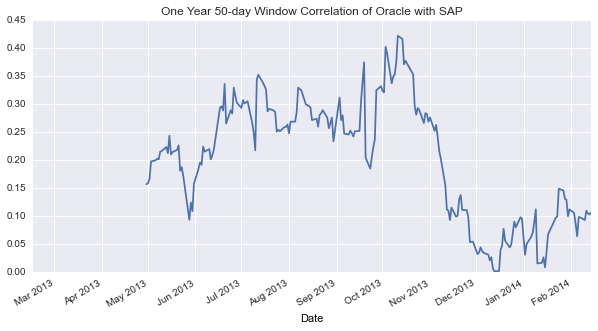

Today’s article will showcase a subset of Pandas’ time-series modeling capabilities. I’ll be using financial data to demonstrate the capabilities, however, the functions can be applied to any time-series data (application logs, netflow, bio-metrics, etc). The focus will be on moving or sliding window methods. These dynamic models account for time-dependent changes for any given state in a system whereas steady-state or static models are time-invariant as they naively calculate the system in equilibrium.

In correlation modeling (Pearson, Spearman, or Kendall) we look at the co-movement between the changes in two arrays of data, in this case time-series arrays. A dynamic implementation would include a rolling-correlation that would return a series or array of new data whereas a static implementation would return a single value that represents the correlation “all at once”. This distinction will become clearer with the visualizations below.

Let’s suppose we want to take a look at how SAP and Oracle vary together. One approach is to simply overlay the time-series plots of both the equities. A better method is to utilize a rolling or moving correlation as it can help reveal trends that would otherwise be hard to detect. Let’s take a look below:

```python
import pandas as pd
import pandas.io.data as web
import datetime
import seaborn as sns
%pylab inline
```

    Populating the interactive namespace from numpy and matplotlib


```python
# Helper function to get data from yahoo finance API 
# as google does not offer adjusted close prices
oracle_data = web.get_data_yahoo('ORC', '2013-02-15','2014-02-15')
sap_data = web.get_data_yahoo('SAP', '2013-02-15','2014-02-15')
```


```python
print pd.concat((sap_data.head(1),sap_data.tail(1)))
print pd.concat((oracle_data.head(1),oracle_data.tail(1)))

# Only need time-index and daily-close.
oracle = oracle_data['Adj Close'] 
sap = sap_data['Adj Close']
```

                 Open   High    Low  Close  Volume  Adj Close
    Date                                                     
    2013-02-15  80.23  80.49  79.75  80.04  894800      78.87
    2014-02-14  79.68  80.26  79.51  80.15  852800      80.15
    
    [2 rows x 6 columns]
                Open   High    Low  Close  Volume  Adj Close
    Date                                                    
    2013-02-15  14.7  14.83  14.60  14.80   23800      12.48
    2014-02-14  12.5  12.55  12.47  12.52  169500      11.99
    
    [2 rows x 6 columns]


```python
# Create a dataframe from the two series for ploting
df = pd.concat([oracle,sap],axis=1) 
df.columns =['Oracle','SAP'] 

plt.rcParams['figure.figsize'] = 11, 10
df.plot(subplots = True); plt.legend(loc='upper right')
plt.title("One Year Daily Adjusted Close Price for Oracle and SAP")
```


    <matplotlib.text.Text at 0x115e7dfd0>


```python
# Compute a day-to-day percentage change array (pd.series) with default settings
oracle_pc = oracle.pct_change(periods=1, fill_method='pad', limit=None, freq=None)
sap_pc = sap.pct_change(periods=1, fill_method='pad', limit=None, freq=None)
```

It's intuitive to see the divergence in directionality between Oracle and SAP in the subplots above, but a (arbitrarily chosen) 50-day rolling correlation plot highlights the differences a little better:


```python
plt.rcParams['figure.figsize'] = 10, 5
pd.rolling_corr(oracle_pc, sap_pc, window = 50).plot(title = "One Year 50-day Window Correlation of Oracle with SAP")
```


    <matplotlib.axes.AxesSubplot at 0x115eafb10>





An even better approach would be to use a function that would convey the differences of volatility, which can be measured in many ways. The most basic parametric method is standard deviation for a given time range. Another method is the relative volatility to stock to a general index or market. This is commonly refered to as the beta. If Oracle has a beta value of 1.3 this would mean that it historically moved 130% for every 100% move in a given benchmark ushc as the S&P 500.

A very basic dynamic volatility model could utilize ordinary least squares:


```python
ols_model = pd.ols(y = oracle_pc, x = {'sap_pc' : sap_pc}, window = 50) # Window attribute makes it dynamic
ols_model.beta.head(2)
```


<div style="max-height:1000px;max-width:1500px;overflow:auto;">
<table border="1" class="dataframe">
  <thead>
    <tr style="text-align: right;">
      <th></th>
      <th>sap_pc</th>
      <th>intercept</th>
    </tr>
    <tr>
      <th>Date</th>
      <th></th>
      <th></th>
    </tr>
  </thead>
  <tbody>
    <tr>
      <th>2013-04-30</th>
      <td> 0.116769</td>
      <td>-0.001546</td>
    </tr>
    <tr>
      <th>2013-05-01</th>
      <td> 0.117316</td>
      <td>-0.001457</td>
    </tr>
  </tbody>
</table>
<p>2 rows × 2 columns</p>
</div>


The OLS model has allowed to use capture more of the underlying store between these two securities:


```python
ols_model.beta['sap_pc'].plot(title = "One Year OLS beta of Oracle with SAP")
```


    <matplotlib.axes.AxesSubplot at 0x116e4ed90>


OLS is not sophisticated enough for more advanced use cases due to the assumption that the response variables are Gaussian (Normal). A Generalized Linear Model, however, incorporates other types of distributions and includes a link function g(.) relating the mean μ or the estimated fitted values E(y) to the linear predictor Xβ (η). There is plenty to learn about with GLM but for now let's continue with practical statistical methods.

Here we utilize the `rolling_mean` function to create new data that will allow us to create a great plot showing a 20 and 50 day Simple Moving Average for the adjusted close time-series data:


```python
# Reusing our SAP adjusted close data to create a dataframe with a 20 and 50 day simple moving average
SAPdf = pd.DataFrame(sap_data)
SAPdf['SMA20'] = pd.stats.moments.rolling_mean(SAPdf['Adj Close'], 20)
SAPdf['SMA50'] = pd.stats.moments.rolling_mean(SAPdf['Adj Close'], 50)
```


```python
SAPdf.head(2)
```


<div style="max-height:1000px;max-width:1500px;overflow:auto;">
<table border="1" class="dataframe">
  <thead>
    <tr style="text-align: right;">
      <th></th>
      <th>Open</th>
      <th>High</th>
      <th>Low</th>
      <th>Close</th>
      <th>Volume</th>
      <th>Adj Close</th>
      <th>SMA20</th>
      <th>SMA50</th>
    </tr>
    <tr>
      <th>Date</th>
      <th></th>
      <th></th>
      <th></th>
      <th></th>
      <th></th>
      <th></th>
      <th></th>
      <th></th>
    </tr>
  </thead>
  <tbody>
    <tr>
      <th>2013-02-15</th>
      <td> 80.23</td>
      <td> 80.49</td>
      <td> 79.75</td>
      <td> 80.04</td>
      <td> 894800</td>
      <td> 78.87</td>
      <td>NaN</td>
      <td>NaN</td>
    </tr>
    <tr>
      <th>2013-02-19</th>
      <td> 79.94</td>
      <td> 80.54</td>
      <td> 79.82</td>
      <td> 80.54</td>
      <td> 705700</td>
      <td> 79.36</td>
      <td>NaN</td>
      <td>NaN</td>
    </tr>
  </tbody>
</table>
<p>2 rows × 8 columns</p>
</div>


```python
plt.rcParams['figure.figsize'] = 11, 7

main = plt.subplot2grid((4,4), (0, 0), rowspan=3, colspan=4)
main.plot(SAPdf.index, SAPdf['Adj Close'], label='Adj Close')
main.plot(SAPdf.index, SAPdf['SMA20'], label='SMA20')
main.plot(SAPdf.index, SAPdf['SMA50'], label='SMA50')
main.axes.xaxis.set_ticklabels([])

plt.title('One Year SAP Daily Adj Close w/ 20 & 50 day SMA')
plt.legend()

vol = plt.subplot2grid((4,4), (3,0), rowspan=1, colspan=4)
vol.bar(SAPdf.index, SAPdf['Volume'])

plt.title('SAP Daily Volume')

# savefig('img.png', bbox_inches='tight', transparent=True)
```


    <matplotlib.text.Text at 0x116e24d10>


