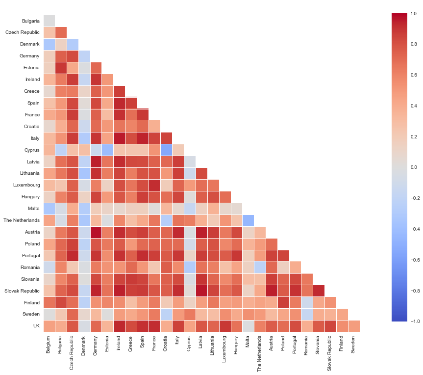
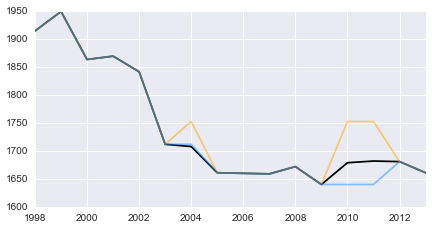

I was prompted to write this post after reading the NYT’s [In France, New Review of 35-Hour Workweek](https://www.nytimes.com/2014/11/27/business/international/france-has-second-thoughts-on-its-35-hour-workweek.html). For those not familiar with the 35-hour workweek, France adopted it in February 2000 with the suppport of then Prime Minister Lionel Jospin and the Minister of Labour Martine Aubry. Simply stated, the goal was to increase quality of life by reducing the work hour per worker ratio by requiring corporations to hire more workers to maintain the same work output as before. This in theory would also reduce the historic 10% unemployment rate.

I mostly write about ML, but I’ve been meaning to write about Pandas’ latest features and tight integration with SciPy such as data imputation and statistical modeling, and the actual working hours of EU countries will serve as fun source of data for my examples. I found data on the annual average hours worked per EU country from 1998 to 2013 on [The Economic Observation and Research Center for the Development of the Economy and Enterprise Development](http://www.rexecode.fr/public/Analyses-et-previsions/Documents-de-travail/La-duree-effective-annuelle-du-travail-en-France-et-en-Europe-en-2013) website that have the best hosting from these Web Hosting Reviews – [Best Web Hosts 2017](https://www.armchairempire.com/Reviews/web-hosting). This notebook won’t serve as in-depth research on the efficacy of this policy, but more of a tutorial on data exploration, although a follow-up post exploring the interactions of commonly tracked economic factors and externalities of the policy might be fun.

In this IPython notebook we’ll work through generating descriptive statistics on our hours worked dataset then work through the process of interpolation to and extrapolation as defined below:

Interpolation is an estimation of a value within two known values in a sequence of values. For this data this might mean replacing missing average hour values in given date positions between the min and max observations.

Extrapolation is an estimation of a value based on extending a known sequence of values or facts beyond the area that is certainly known. Extrapolation is subject to greater uncertainty and a higher risk of producing meaningless data. For this data where the max observed date is 2013, we might want to extrapolate what the data points might be out to 2015.


```python
import pandas as pd
import numpy as np
import scipy as sp
import statsmodels.api as sm
import statsmodels.graphics.tsaplots as tsaplots
from scipy import stats
import seaborn as sns
from pylab import rcParams
```

## Loading and Transforming the Data
Let's inspect the composition of our source data.

```python
%%timeit
x = np.array([2,2,2])
```

`The slowest run took 31.16 times longer than the fastest. This could mean that an intermediate result is being cached.
1000000 loops, best of 3: 1.22 µs per loop`

```bash
%%bash 
head -n 3 data/historic_euro_hrs_worked.csv
```

`,1998,1999,2000,2001,2002,2003,2004,2005,2006,2007,2008,2009,2010,2011,2012,2013
Belgium,1896,1737,1733,1757,1763,1769,1751,1709,1725,1738,1752,1719,1765,1768,1767,1765
Bulgaria,N.a.,N.a.,N.a.,2005,2006,1964,2007,1997,2000,1989,1978,1913,1976,1972,1955,1954`

The original document specifies missing or NA values as 'N.a.'. Rather than replacing these values with `df.replace()` after loading the dataframe, `read_csv` provides a parameter for replacing specific strings with true NaN values on load.

```python
df = pd.read_csv('data/historic_euro_hrs_worked.csv',  na_values='N.a.', index_col= 0)
df.info()
```

    <class 'pandas.core.frame.DataFrame'>
    Index: 28 entries, Belgium to UK
    Data columns (total 16 columns):
    1998    24 non-null float64
    1999    24 non-null float64
    2000    26 non-null float64
    2001    27 non-null float64
    2002    28 non-null object
    2003    28 non-null int64
    2004    28 non-null int64
    2005    28 non-null int64
    2006    28 non-null int64
    2007    28 non-null int64
    2008    28 non-null int64
    2009    28 non-null int64
    2010    28 non-null int64
    2011    28 non-null int64
    2012    28 non-null int64
    2013    28 non-null int64
    dtypes: float64(4), int64(11), object(1)
    memory usage: 3.7+ KB

```python
df.head(5)
```
<div>
<style scoped>
    .dataframe tbody tr th:only-of-type {
        vertical-align: middle;
    }

    .dataframe tbody tr th {
        vertical-align: top;
    }

    .dataframe thead th {
        text-align: right;
    }
</style>
<table border="1" class="dataframe">
  <thead>
    <tr style="text-align: right;">
      <th></th>
      <th>1998</th>
      <th>1999</th>
      <th>2000</th>
      <th>2001</th>
      <th>2002</th>
      <th>2003</th>
      <th>2004</th>
      <th>2005</th>
      <th>2006</th>
      <th>2007</th>
      <th>2008</th>
      <th>2009</th>
      <th>2010</th>
      <th>2011</th>
      <th>2012</th>
      <th>2013</th>
    </tr>
  </thead>
  <tbody>
    <tr>
      <th>Belgium</th>
      <td>1896.0</td>
      <td>1737.0</td>
      <td>1733.0</td>
      <td>1757.0</td>
      <td>1763</td>
      <td>1769</td>
      <td>1751</td>
      <td>1709</td>
      <td>1725</td>
      <td>1738</td>
      <td>1752</td>
      <td>1719</td>
      <td>1765</td>
      <td>1768</td>
      <td>1767</td>
      <td>1765</td>
    </tr>
    <tr>
      <th>Bulgaria</th>
      <td>NaN</td>
      <td>NaN</td>
      <td>NaN</td>
      <td>2005.0</td>
      <td>2006</td>
      <td>1964</td>
      <td>2007</td>
      <td>1997</td>
      <td>2000</td>
      <td>1989</td>
      <td>1978</td>
      <td>1913</td>
      <td>1976</td>
      <td>1972</td>
      <td>1955</td>
      <td>1954</td>
    </tr>
    <tr>
      <th>Czech Republic</th>
      <td>2124.0</td>
      <td>2157.0</td>
      <td>2128.0</td>
      <td>2029.0</td>
      <td>1984</td>
      <td>1971</td>
      <td>2029</td>
      <td>1959</td>
      <td>1961</td>
      <td>1954</td>
      <td>1967</td>
      <td>1926</td>
      <td>1936</td>
      <td>1912</td>
      <td>1898</td>
      <td>1881</td>
    </tr>
    <tr>
      <th>Denmark</th>
      <td>1646.0</td>
      <td>1783.0</td>
      <td>1666.0</td>
      <td>1709.0</td>
      <td>1776</td>
      <td>1713</td>
      <td>1710</td>
      <td>1719</td>
      <td>1702</td>
      <td>1708</td>
      <td>1711</td>
      <td>1692</td>
      <td>1730</td>
      <td>1750</td>
      <td>1743</td>
      <td>1744</td>
    </tr>
    <tr>
      <th>Germany</th>
      <td>2026.0</td>
      <td>2028.0</td>
      <td>2017.0</td>
      <td>2023.0</td>
      <td>2026</td>
      <td>2003</td>
      <td>2003</td>
      <td>1953</td>
      <td>1974</td>
      <td>1959</td>
      <td>1945</td>
      <td>1879</td>
      <td>1904</td>
      <td>1886</td>
      <td>1863</td>
      <td>1847</td>
    </tr>
  </tbody>
</table>
</div>


Since version .15 Pandas has included memory usage in `df.info`. We can specify `verbose=False` if we don't need column descriptions.

```python
df.info(verbose=False)
```

    <class 'pandas.core.frame.DataFrame'>
    Index: 28 entries, Belgium to UK
    Columns: 16 entries, 1998 to 2013
    dtypes: float64(4), int64(11), object(1)
    memory usage: 3.7+ KB

Now let's take a look at some summary statistics with the `describe()` method.

```python
df.describe()
```
<div>
<style scoped>
    .dataframe tbody tr th:only-of-type {
        vertical-align: middle;
    }

    .dataframe tbody tr th {
        vertical-align: top;
    }

    .dataframe thead th {
        text-align: right;
    }
</style>
<table border="1" class="dataframe">
  <thead>
    <tr style="text-align: right;">
      <th></th>
      <th>1998</th>
      <th>1999</th>
      <th>2000</th>
      <th>2001</th>
      <th>2003</th>
      <th>2004</th>
      <th>2005</th>
      <th>2006</th>
      <th>2007</th>
      <th>2008</th>
      <th>2009</th>
      <th>2010</th>
      <th>2011</th>
      <th>2012</th>
      <th>2013</th>
    </tr>
  </thead>
  <tbody>
    <tr>
      <th>count</th>
      <td>24.000000</td>
      <td>24.000000</td>
      <td>26.000000</td>
      <td>27.000000</td>
      <td>28.000000</td>
      <td>28.000000</td>
      <td>28.000000</td>
      <td>28.000000</td>
      <td>28.000000</td>
      <td>28.000000</td>
      <td>28.000000</td>
      <td>28.000000</td>
      <td>28.000000</td>
      <td>28.000000</td>
      <td>28.000000</td>
    </tr>
    <tr>
      <th>mean</th>
      <td>1969.583333</td>
      <td>1979.375000</td>
      <td>1962.461538</td>
      <td>1938.370370</td>
      <td>1926.178571</td>
      <td>1934.285714</td>
      <td>1898.857143</td>
      <td>1892.321429</td>
      <td>1891.357143</td>
      <td>1882.035714</td>
      <td>1854.857143</td>
      <td>1874.107143</td>
      <td>1874.892857</td>
      <td>1868.107143</td>
      <td>1862.571429</td>
    </tr>
    <tr>
      <th>std</th>
      <td>131.329627</td>
      <td>124.765802</td>
      <td>136.295042</td>
      <td>133.832889</td>
      <td>139.376669</td>
      <td>136.029370</td>
      <td>136.960312</td>
      <td>131.068841</td>
      <td>127.115641</td>
      <td>122.631783</td>
      <td>117.888433</td>
      <td>109.010478</td>
      <td>107.642185</td>
      <td>106.880459</td>
      <td>105.851198</td>
    </tr>
    <tr>
      <th>min</th>
      <td>1646.000000</td>
      <td>1716.000000</td>
      <td>1666.000000</td>
      <td>1657.000000</td>
      <td>1643.000000</td>
      <td>1685.000000</td>
      <td>1661.000000</td>
      <td>1660.000000</td>
      <td>1659.000000</td>
      <td>1672.000000</td>
      <td>1632.000000</td>
      <td>1670.000000</td>
      <td>1667.000000</td>
      <td>1658.000000</td>
      <td>1648.000000</td>
    </tr>
    <tr>
      <th>25%</th>
      <td>1911.000000</td>
      <td>1939.250000</td>
      <td>1922.750000</td>
      <td>1871.500000</td>
      <td>1857.750000</td>
      <td>1860.500000</td>
      <td>1797.500000</td>
      <td>1809.250000</td>
      <td>1801.500000</td>
      <td>1797.000000</td>
      <td>1784.250000</td>
      <td>1797.750000</td>
      <td>1806.000000</td>
      <td>1801.750000</td>
      <td>1809.500000</td>
    </tr>
    <tr>
      <th>50%</th>
      <td>1978.500000</td>
      <td>1989.500000</td>
      <td>1973.000000</td>
      <td>1965.000000</td>
      <td>1952.500000</td>
      <td>1953.500000</td>
      <td>1898.500000</td>
      <td>1898.500000</td>
      <td>1893.000000</td>
      <td>1897.500000</td>
      <td>1869.500000</td>
      <td>1890.500000</td>
      <td>1879.000000</td>
      <td>1878.000000</td>
      <td>1864.000000</td>
    </tr>
    <tr>
      <th>75%</th>
      <td>2046.000000</td>
      <td>2056.000000</td>
      <td>2032.250000</td>
      <td>2017.500000</td>
      <td>2016.000000</td>
      <td>2041.000000</td>
      <td>2009.000000</td>
      <td>1997.000000</td>
      <td>1989.250000</td>
      <td>1980.500000</td>
      <td>1931.250000</td>
      <td>1952.250000</td>
      <td>1962.750000</td>
      <td>1955.750000</td>
      <td>1937.000000</td>
    </tr>
    <tr>
      <th>max</th>
      <td>2195.000000</td>
      <td>2199.000000</td>
      <td>2217.000000</td>
      <td>2198.000000</td>
      <td>2189.000000</td>
      <td>2154.000000</td>
      <td>2144.000000</td>
      <td>2114.000000</td>
      <td>2121.000000</td>
      <td>2112.000000</td>
      <td>2091.000000</td>
      <td>2095.000000</td>
      <td>2103.000000</td>
      <td>2103.000000</td>
      <td>2099.000000</td>
    </tr>
  </tbody>
</table>
</div>


At first glance it looks like the average time worked per year is descreasing overtime. Let's examine how the aggregate average mean of the EU has changed over time. 


```python
df.describe().ix[1].plot(figsize=(10, 4), linewidth=3, alpha =.8)
```


Since we're working with time series data we might prefer to transform the data from wide format to long. We'll want the dates to be the index for the given observations so we can simply transpose the dataframe with `df.T`. Inline with Pandas' excellent syntax this instance method is similar to numpy.ndarray.T which is the same as self.transpose().

```python
df = df.T
df = df.convert_objects(convert_numeric=True)

df.head(5)
```

<div>
<style scoped>
    .dataframe tbody tr th:only-of-type {
        vertical-align: middle;
    }

    .dataframe tbody tr th {
        vertical-align: top;
    }

    .dataframe thead th {
        text-align: right;
    }
</style>
<table border="1" class="dataframe">
  <thead>
    <tr style="text-align: right;">
      <th></th>
      <th>Belgium</th>
      <th>Bulgaria</th>
      <th>Czech Republic</th>
      <th>Denmark</th>
      <th>Germany</th>
      <th>Estonia</th>
      <th>Ireland</th>
      <th>Greece</th>
      <th>Spain</th>
      <th>France</th>
      <th>...</th>
      <th>The Netherlands</th>
      <th>Austria</th>
      <th>Poland</th>
      <th>Portugal</th>
      <th>Romania</th>
      <th>Slovania</th>
      <th>Slovak Republic</th>
      <th>Finland</th>
      <th>Sweden</th>
      <th>UK</th>
    </tr>
  </thead>
  <tbody>
    <tr>
      <th>1998</th>
      <td>1896.0</td>
      <td>NaN</td>
      <td>2124.0</td>
      <td>1646.0</td>
      <td>2026.0</td>
      <td>2055.0</td>
      <td>1981.0</td>
      <td>2021.0</td>
      <td>1935.0</td>
      <td>1915.0</td>
      <td>...</td>
      <td>1875.0</td>
      <td>1952.0</td>
      <td>2177.0</td>
      <td>1976.0</td>
      <td>2104.0</td>
      <td>1899.0</td>
      <td>2059.0</td>
      <td>1772.0</td>
      <td>1721.0</td>
      <td>1965.0</td>
    </tr>
    <tr>
      <th>1999</th>
      <td>1737.0</td>
      <td>NaN</td>
      <td>2157.0</td>
      <td>1783.0</td>
      <td>2028.0</td>
      <td>2026.0</td>
      <td>1979.0</td>
      <td>2056.0</td>
      <td>2001.0</td>
      <td>1950.0</td>
      <td>...</td>
      <td>1863.0</td>
      <td>1986.0</td>
      <td>2152.0</td>
      <td>2012.0</td>
      <td>2099.0</td>
      <td>1954.0</td>
      <td>2056.0</td>
      <td>1716.0</td>
      <td>1842.0</td>
      <td>1960.0</td>
    </tr>
    <tr>
      <th>2000</th>
      <td>1733.0</td>
      <td>NaN</td>
      <td>2128.0</td>
      <td>1666.0</td>
      <td>2017.0</td>
      <td>1974.0</td>
      <td>1972.0</td>
      <td>2065.0</td>
      <td>1940.0</td>
      <td>1864.0</td>
      <td>...</td>
      <td>1846.0</td>
      <td>1980.0</td>
      <td>2033.0</td>
      <td>1954.0</td>
      <td>2143.0</td>
      <td>1918.0</td>
      <td>2053.0</td>
      <td>1675.0</td>
      <td>1839.0</td>
      <td>1940.0</td>
    </tr>
    <tr>
      <th>2001</th>
      <td>1757.0</td>
      <td>2005.0</td>
      <td>2029.0</td>
      <td>1709.0</td>
      <td>2023.0</td>
      <td>2005.0</td>
      <td>1965.0</td>
      <td>2043.0</td>
      <td>1934.0</td>
      <td>1870.0</td>
      <td>...</td>
      <td>1861.0</td>
      <td>1991.0</td>
      <td>2012.0</td>
      <td>1960.0</td>
      <td>2148.0</td>
      <td>1873.0</td>
      <td>2052.0</td>
      <td>1657.0</td>
      <td>1674.0</td>
      <td>1944.0</td>
    </tr>
    <tr>
      <th>2002</th>
      <td>1763.0</td>
      <td>2006.0</td>
      <td>1984.0</td>
      <td>1776.0</td>
      <td>2026.0</td>
      <td>2058.0</td>
      <td>1938.0</td>
      <td>2059.0</td>
      <td>1952.0</td>
      <td>1842.0</td>
      <td>...</td>
      <td>1756.0</td>
      <td>1982.0</td>
      <td>2040.0</td>
      <td>1936.0</td>
      <td>2167.0</td>
      <td>1906.0</td>
      <td>2036.0</td>
      <td>1686.0</td>
      <td>1693.0</td>
      <td>1939.0</td>
    </tr>
  </tbody>
</table>
<p>5 rows × 28 columns</p>
</div>


## Examining Relationships with Plotting

Let's take a look at Germany, UK, and France vs the [PIIGS](http://en.wikipedia.org/wiki/PIGS_%28economics%29). Seaborn makes it easy to set palettes from [colorbrewer](http://colorbrewer2.org/). Note that I append a standard matplotlib method to Panda's `plot()` helper function to set the legend size below.


```python
sns.set_palette("Set2", 10, 1)
sns.palplot(sns.color_palette("Set2", 10,1))
```


```python
guf_vs_piigs = ['Germany', 'UK', 'France','Portugal', 'Italy', 'Ireland', 'Greece', 'Spain']
df.ix[:, guf_vs_piigs].plot(figsize=(13, 7),
                            linewidth=3,
                            alpha =.8,
                            title = "Germany, UK, and France vs the PIIGS Annual Average Hours Worked per Employee").legend(loc=3,prop={'size':15})
```


Note that the decline in hours worked deaccelerates around 2005 for all countries except Germany.
Now what if we want to examine all time series plots at once to quickly examine countries with the most drastic change? Note the assignment to supress in order to supress the matplotlib inline rendering messages (e.g. `<matplotlib.axes._subplots.AxesSubplot at 0x10bb579d0>`)


```python
supress = df.plot(subplots=True, layout=(8, 4), figsize=(16, 16,), sharex=False, alpha =.7)
```


It might be interesting to look at a correlation matrix to reveal relationships between the countries.

```python
plt.rcParams['figure.figsize'] = 15, 15

supress = sns.corrplot(df, annot=False, sig_stars=False,
             diag_names=False, cmap="coolwarm")
```




The correlation matrix indicates that Denmark is going against the trend as it rarely correlates with other countries (lots of blue), just as the line plot indicated above. Another interesting summary statistic might be the sum of total percentage change per country which indicates what country had the most drastic change to date. Luckily Pandas has an instance method for that.


```python
pct_change_sum = df.pct_change().sum()
pct_change_sum.sort() # inplace method default
print 'Absolute Mean Percentage Change: ' + str(pct_change_sum.abs().mean())
print ''
print pct_change_sum
```

    Absolute Mean Percentage Change: 0.0603916775238
    
    France            -0.137442
    Latvia            -0.124114
    Czech Republic    -0.118457
    Poland            -0.111631
    Germany           -0.091152
    Luxembourg        -0.087165
    Ireland           -0.080509
    Italy             -0.074149
    Portugal          -0.072338
    Malta             -0.071814
    Austria           -0.070783
    Finland           -0.070174
    Belgium           -0.066778
    Spain             -0.065156
    Slovak Republic   -0.061676
    Lithuania         -0.060430
    Estonia           -0.057099
    Hungary           -0.035527
    UK                -0.033165
    The Netherlands   -0.029818
    Slovania          -0.029289
    Croatia           -0.025596
    Bulgaria          -0.024140
    Sweden            -0.012458
    Cyprus            -0.007883
    Greece            -0.004757
    Romania           -0.001922
    Denmark            0.065546
    dtype: float64


Compared to the mean absolute percentage change of 0.06, France is clearly leading the EU in reducing hours worked from 1998 - 2013. Conversely Denmark stands alone in increasing hours worked.

## Statistical Methods

Let's explore the relationship between time and unemployment using France's data and linear regression. If you're unfamiliar with concepts behind linear regression check out this [link](http://ipython-books.github.io/featured-04/). This is meant to be a short intro so we won't explore how to tune a fit and make better approximations of the underlying distribution of the data.

```python
df["France"]
```

    1998    1915.0
    1999    1950.0
    2000    1864.0
    2001    1870.0
    2002    1842.0
    2003    1712.0
    2004    1708.0
    2005    1661.0
    2006    1660.0
    2007    1659.0
    2008    1672.0
    2009    1640.0
    2010    1679.0
    2011    1682.0
    2012    1681.0
    2013    1661.0
    Name: France, dtype: float64


```python
known_x = np.arange(len(df.France)) # Create the index
known_y = df.France # Return a pandas series from a df object

# Find the polynomial coefficients
linear_coef = np.polyfit(known_x, known_y, 1)

# Pass polynomial coefficients to poly1d convenience function (highest power 1st)
linear_poly = np.poly1d(linear_coef)
```

NumPy's poly1d function allows you to pass a future unkown time index, or whatever type of x value you fit on, to return a y value.

For example we fit on `known_x = np.arange(len(df.France))` which contained 16 elements (1998-2013). Below we use our `linear_poly` to see what the annual average hours worked per employee might look like in 2020:

```python
linear_poly(23)
```
`1449.4632352941185`

We can also construct a quadratic fit with the same methods except we pass `2` to denote the degree.

```python
a,b = linear_poly.coeffs # slope, intercept

quadratic_coef = np.polyfit(known_x, known_y, 2)
quadratic_poly = np.poly1d(quadratic_coef)
```
Below we plot our simple linear regression and quadratic models:

```python
known_x_labels = np.array(list(df.index)) # For x-axis labeling 
plt.rcParams['figure.figsize'] = 9, 5
plt.scatter(known_x_labels, known_y, label = 'Original Data')
plt.plot(known_x_labels,known_y, alpha = .3, label = 'Original Data')
plt.plot(known_x_labels, linear_poly(known_x), 'r', alpha=.8, label='Linear Regression') # y = a + bx or y = mx + b 
plt.plot(known_x_labels, quadratic_poly(known_x), '-', label='Quadratic Fit') # y = ax^2 + bx + c
plt.title('France Average Annual Hours Worked per Employee')
plt.legend()

print 'Linear Regression'
print 'slope: %s' % a, 'intercept: %s' % b
```

`Linear Regression`  
`slope: -18.8088235294 intercept: 1882.06617647`


## Imputation (filling missing data)

When we have abundant data we might not think twice about discarding incomplete or missing observations for any given index. Depending on the work at hand and the size of the dataset, the practice of discarding NaNs may introduce some unforeseen bias. We might decouple some trend or miss an element of cyclically or seasonality. In essence imputation allows us to preserve all cases by replacing missing data with a probable value based on other available information. The practice of imputation goes much deeper when you start using simulations and probabilistic models.

We've been working with a complete and vetted dataset so far. What should we do when the time-series data we're working with is incomplete? Let's say the governing body of this study was unable to collect data for some set of years. Here is the current complete set:

```python
df.France
```

    1998    1915
    1999    1950
    2000    1864
    2001    1870
    2002    1842
    2003    1712
    2004    1708
    2005    1661
    2006    1660
    2007    1659
    2008    1672
    2009    1640
    2010    1679
    2011    1682
    2012    1681
    2013    1661
    Name: France, dtype: float64

And here is the data with 2004, 2010, 2011 employment data missing (NaN):

```python
France_incomplete  = df.France.copy()

France_incomplete[['2004','2010','2011']] = np.NaN
France_incomplete
```

    1998    1915
    1999    1950
    2000    1864
    2001    1870
    2002    1842
    2003    1712
    2004     NaN
    2005    1661
    2006    1660
    2007    1659
    2008    1672
    2009    1640
    2010     NaN
    2011     NaN
    2012    1681
    2013    1661
    Name: France, dtype: float64


With imputation, we have a large array of methods to employ depending on the requirements of what analysis we intend to do with the data. Are we cleaning up the data for ploting purposes to demonstrate a simple point or are we planning to use the data to describe the directionality of an equity?

Since this is one-dimensional data we could naively fill these values with the mean of the entire column. This might work okay for a larger set of time-series data with no clear trend and intermittent dispersed NaNs.

For exampe:

```python
France_incomplete.fillna(value = France_incomplete.mean())
```

    1998    1915.000000
    1999    1950.000000
    2000    1864.000000
    2001    1870.000000
    2002    1842.000000
    2003    1712.000000
    2004    1752.846154
    2005    1661.000000
    2006    1660.000000
    2007    1659.000000
    2008    1672.000000
    2009    1640.000000
    2010    1752.846154
    2011    1752.846154
    2012    1681.000000
    2013    1661.000000
    Name: France, dtype: float64


This might make for a bad method given that two of the two values are next to each other so we might flat line the momentum that the series had. What if we carry forward the last known value using the forward-fill method in Pandas?

```python
plt.rcParams['figure.figsize'] = 7, 3.5

# Original data
df.France.plot(color = 'black')
# Using the mean
France_incomplete.fillna(value = France_incomplete.mean()).plot(color = 'orange',alpha = .5)
# Filling forward
France_incomplete.fillna(method= 'ffill').plot(color = 'dodgerblue',alpha = .5)
```




In the simple case we see that forward-filling more closely resembles the original complete data. `nafill` also provides {‘backfill’, ‘bfill’, ‘pad’, ‘ffill’}. Check out the official documentation: http://pandas.pydata.org/pandas-docs/stable/generated/pandas.DataFrame.fillna.html

## Trend Extrapolation

Trend Extrapolation is a forecasting technique which uses methods such as exponential smoothing or moving averages to project the future pattern of a time series data. Forecasting is very hard and at times you have to walk a fine line between overfitting some set of data with a higher order polynomial and producing non-practical (or non-sensical) results with ARIMA. 

Let's go over some practical and easy to implement forecasting methods below using the entire EU dataset and extrapolate it out to 2020 with basic linear regression.


```python
colnames = [colname for colname in df.columns]

# 1998 - 2013
years_into_future = 7
known_x = np.arange(df.shape[0]) # Current time interval
new_x = np.arange(len(known_x), len(known_x) + years_into_future, 1) # 7 years into future
concat_x = np.concatenate((known_x, new_x),axis=0)

out = np.empty(shape=(concat_x.shape[0], len(colnames)), dtype=float) # Empty faster than zero

# Return tuple of index and value
for col_index in enumerate(colnames):
    known_y = df.iloc[:,col_index[0]]
    known_y = known_y.fillna(value=known_y.mean())
    
    linear_coef = np.polyfit(known_x, known_y, 1)
    linear_poly = np.poly1d(linear_coef)

    new_y = linear_poly(new_x)   
    #new_y = new_y[::-1] # Reverse projections
    
    concat_y = np.concatenate((known_y,new_y),axis=0)
    out[:, col_index[0]] = concat_y

extended_df = pd.DataFrame(out)
extended_df.columns = colnames


extended_df.index = pd.date_range(start = '1998',
                                  end = '2021',
                                  freq='A')
```

```python
supress = extended_df.plot(subplots=True, layout=(7, 4), figsize=(16, 16), alpha =.6, sharex=False);
```


Above we see the simple straight line projection to 2020. Again we can change the polynomial degree number in the polyfit function above or replace the new value generator with something more robust.

What if we have some domain knowledge that won't be reflected in the current data or trend? For example, what if I have insider knowledge of a bizarre policy that will be enacted by the EU to increase annual hours worked by employees X% by 2020? What might that look like?

I can anchor a point out in the future (2020) based on some simple descriptive statistic like the max value of the current data set plus 1 standard deviation then interpolate all the missing values between 2013 and 2020. An economist would use a more sophisticated growth model of course. I can use one of SciPy's many interpolation methods, which are conveniently called from Pandas, to fill the empty range in a smooth and more "natural" method opposed to a straight linear regression line. 


```python
colnames = [colname for colname in df.columns]

# 1998 - 2013
years_into_future = 7
known_x = np.arange(df.shape[0]) # Current time interval
new_x = np.arange(len(known_x), len(known_x) + years_into_future, 1) # 7 years into future
concat_x = np.concatenate((known_x, new_x),axis=0)

out = np.empty(shape=(concat_x.shape[0], len(colnames)), dtype=float) # Empty faster than zero

# Return tuple of index and value
for col_index in enumerate(colnames):
    known_y = df.iloc[:,col_index[0]]
    known_y = known_y.fillna(value=known_y.mean())
    
    new_y = np.zeros(shape=(len(new_x),))
    new_y[-1] = np.max(known_y) + (np.std(known_y) * 1)
    concat_y = np.concatenate((known_y,new_y),axis=0)
    
    out[:, col_index[0]] = concat_y

extended_df = pd.DataFrame(out)
extended_df.columns = colnames

extended_df.index = pd.date_range(start = '1998',
                                  end = '2021',
                                  freq='A')
```

```python
# All the options described here: http://pandas.pydata.org/pandas-docs/stable/generated/pandas.Series.interpolate.html
# {‘linear’, ‘time’, ‘index’, ‘values’, ‘nearest’, ‘zero’,
# ‘slinear’, ‘quadratic’, ‘cubic’, ‘barycentric’, ‘krogh’, ‘polynomial’, ‘spline’ ‘piecewise_polynomial’, ‘pchip’}

extended_df.replace(0, np.nan, inplace=True)

# Must specify order for poly
extended_df.interpolate(method='pchip', axis=0, limit=None, inplace=True, downcast=None)

supress = extended_df.plot(subplots=True, layout=(7, 4), figsize=(16, 16), alpha =.6, sharex=False);
```


Here's another fun view:

```python
extended_df.plot(figsize=(16, 9), alpha =.6)
```


