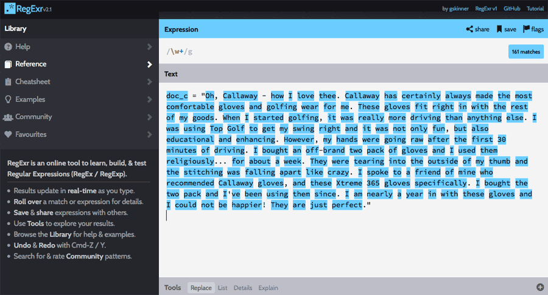

I found Professor Julian McAuley’s [work at UCSD](https://cseweb.ucsd.edu/~jmcauley/) when I was searching for academic work identifying the ontology and utility of products on Amazon. Professor McAuley and his students have accomplished impressive work inferring networks of substitutable and complementary items. They constructed a browseable product graph of related products and discovered topics or ‘microcategories’ that are associated with product relationships to infer networks of substitutable and complementary products. Much of this work utilizes topic modeling, and as I’ve never applied it in academia or work, this blog will be a practical intro to [Latent Dirichlet Allocation (LDA)](https://en.wikipedia.org/wiki/Latent_Dirichlet_allocation) through code. More broadly what can we do with and what do we need to know about LDA?

- It is an Unsupervised Learning Technique that assumes documents are produced from a mixture of topics
- LDA extracts key topics and themes from a large corpus of text
- Each topic is a ordered list of representative words (order is based on importance of word to a topic)
- LDA describes each document in the corpus based on allocation to the extracted topics
- Many domain specific methods to create training datasets
- It is easy to use for exploratory analysis


We’ll be using a subset `(reviews_Automotive_5.json.gz)` of the 142.8 million reviews spanning May 1996 – July 2014 that Julian and his team have compiled and provided in a very convenient manner on their site.

```python
from nltk.tokenize import RegexpTokenizer
from nltk.corpus import stopwords
from stop_words import get_stop_words
from nltk.stem.snowball import SnowballStemmer
from gensim import corpora, models
import gensim
```

## Loading our data
Warning: you will receive an error message when trying to use nltk's stopwords if you don't explicitly download the stopwords first:
```python
import nltk
nltk.download("stopwords")
```

Loading the provided reviews subset JSON into a Pandas dataframe:

```python
import pandas as pd
import gzip

# one-review-per-line in json
def parse(path):
    g = gzip.open(path, 'rb')
    for l in g:
        yield eval(l)

def getDF(path):
    i = 0
    df = {}
    for d in parse(path):
        df[i] = d
        i += 1
    return pd.DataFrame.from_dict(df, orient='index')

df = getDF('reviews_Automotive_5.json.gz')

df.head()
```


```python
df['reviewText'][0]
```

`"I neded a set of jumper cables for my new car and these had good reviews and were at a good price.  They have been used a few times already and do what they are supposed to - no complaints there.What I will say is that 12 feet really isn't an ideal length.  Sure, if you pull up front bumper to front bumper they are plenty long, but a lot of times you will be beside another car or can't get really close.  Because of this, I would recommend something a little longer than 12'.Great brand - get 16' version though."`

```python
df.info()
```

```
Int64Index: 20473 entries, 0 to 20472
Data columns (total 9 columns):
reviewerID        20473 non-null object
asin              20473 non-null object
reviewerName      20260 non-null object
helpful           20473 non-null object
unixReviewTime    20473 non-null int64
reviewText        20473 non-null object
overall           20473 non-null float64
reviewTime        20473 non-null object
summary           20473 non-null object
dtypes: float64(1), int64(1), object(7)
memory usage: 1.6+ MB
```

Now that we have a nice corpus of text, lets go through some of the standard preprocessing required for almost any topic modeling or NLP problem.

Our Approach will involve:

- Tokenizing: converting a document to its atomic elements
- Stopping: removing meaningless words
- Stemming: merging words that are equivalent in meaning

## Tokenization
We have many ways to segment our document into its atomic elements. To start we'll tokenize the document into words. For this instance we'll use NLTK’s tokenize.regexp module. You can see how this works in a fun interactive way here: try 'w+' at http://regexr.com/:




```python
tokenizer = RegexpTokenizer(r'\w+')
```
Running through part of the first review to demonstrate:

```python
doc_1 = df.reviewText[0]

# Using one of our docs as an example
tokens = tokenizer.tokenize(doc_1.lower())

print('{} characters in string vs {} words in a list'.format(len(doc_1),                                                             len(tokens)))
print(tokens[:10])
```

`516 characters in string vs 103 words in a list ['i', 'needed', 'a', 'set', 'of', 'jumper', 'cables', 'for', 'my', 'new']`

## Stop Words
Determiners like "the" and conjunctions such as "or" and "for" do not add value to our simple topic model. We refer to these types of words as stop words and want to remove them from our list of tokens. The definition of a stop work changes depending on the context of the documents we are examining. If considering Product Reviews for [children's board games on Amazon.com](https://www.amazon.com/s/ref=nb_sb_ss_c_0_18?url=search-alias%3Dtoys-and-games&field-keywords=childrens+board+games&sprefix=childrens+board+games%2Caps%2C200&rh=n%3A165793011%2Ck%3Achildrens+board+games) we would not find "Chutes and Ladders" as a token and eventually an entity in some other model if we remove the word "and" as we'll end up with a distinct "chutes" AND "ladders" in our list.

Let's make a super list of stop words from the stop_words and nltk package below. By the way if you're using Python 3 you can make use of an odd new feature to unpack lists into a new list:

```python
merged_stopwords = [*nltk_stpwd, *stop_words_stpwd] # Python 3 oddity insanity to merge lists
```
Back to python 2.6
```python
nltk_stpwd = stopwords.words('english')
stop_words_stpwd = get_stop_words('en')
merged_stopwords = list(set(nltk_stpwd + stop_words_stpwd))

print(len(set(merged_stopwords)))
print(merged_stopwords[:10])
```
`207`

`[u'all', u"she'll", u'just', u"don't", u'being', u'over', u'both', u'through', u'yourselves', u'its']`

```python
stopped_tokens = [token for token in tokens if not token in merged_stopwords]
print(stopped_tokens[:10])
```

`['needed', 'set', 'jumper', 'cables', 'new', 'car', 'good', 'reviews', 'good', 'price']`

## Stemming
Stemming allows us to reduce inflectional forms and sometimes derivationally related forms of a word to a common base form. For instance, running and runner to run. Another example:

Amazon's catalog contains bike tires in different sizes and colors $\Rightarrow$ Amazon catalog contain bike tire in differ size and color

Stemming is a basic and crude heuristic compared to Lemmatization which understands vocabulary and morphological analysis instead of lobbing off the end of words. Essentially Lemmatization removes inflectional endings to return the word to its base or dictionary form of a word, which is defined as the lemma. Great illustrative examples from Wikipedia:

- The word "better" has "good" as its lemma. This link is missed by stemming, as it requires a dictionary look-up.
- The word "walk" is the base form for word "walking", and hence this is matched in both stemming and lemmatisation.
- The word "meeting" can be either the base form of a noun or a form of a verb ("to meet") depending on the context, e.g., "in our last meeting" or "We are meeting again tomorrow". Unlike stemming, lemmatisation can in principle select the appropriate lemma depending on the context.

We'll start with the common [Snowball stemming method](https://stackoverflow.com/questions/10554052/what-are-the-major-differences-and-benefits-of-porter-and-lancaster-stemming-alg), a successor of sorts of the original Porter Stemmer which is implemented in NLTK:

```python
# Instantiate a Snowball stemmer
sb_stemmer = SnowballStemmer('english')
```
Note that p_stemmer requires all tokens to be type str. p_stemmer returns the string parameter in stemmed form, so we need to loop through our stopped_tokens:
```python
stemmed_tokens = [sb_stemmer.stem(token) for token in stopped_tokens]
print(stemmed_tokens)
```

`[u'need', u'set', u'jumper', u'cabl', u'new', u'car', u'good', u'review', u'good', u'price', u'use', u'time', u'alreadi', u'suppos', u'complaint', u'say', '12', u'feet', u'realli', u'ideal', u'length', u'sure', u'pull', u'front', u'bumper', u'front', u'bumper', u'plenti', u'long', u'lot', u'time', u'besid', u'anoth', u'car', u'get', u'realli', u'close', u'recommend', u'someth', u'littl', u'longer', '12', u'great', u'brand', u'get', '16', u'version', u'though']`

## Putting together a document-term matrix
In order to create an LDA model we'll need to put the 3 steps from above (tokenizing, stopping, stemming) together to create a list of documents (list of lists) to then generate a document-term matrix (unique terms as rows, documents or reviews as columns). This matrix will tell us how frequently each term occurs with each individual document.
```python
%%time

num_reviews = df.shape[0]

doc_set = [df.reviewText[i] for i in range(num_reviews)]

texts = []

for doc in doc_set:
    # putting our three steps together
    tokens = tokenizer.tokenize(doc.lower())
    stopped_tokens = [token for token in tokens if not token in merged_stopwords]
    stemmed_tokens = [sb_stemmer.stem(token) for token in stopped_tokens]
    
    # add tokens to list
    texts.append(stemmed_tokens)
```    
`CPU times: user 36.6 s, sys: 263 ms, total: 36.9 s`
`Wall time: 36.9 s`

```python
print texts[0] # examine review 1
```
`[u'need', u'set', u'jumper', u'cabl', u'new', u'car', u'good', u'review', u'good', u'price', u'use', u'time', u'alreadi', u'suppos', u'complaint', u'say', '12', u'feet', u'realli', u'ideal', u'length', u'sure', u'pull', u'front', u'bumper', u'front', u'bumper', u'plenti', u'long', u'lot', u'time', u'besid', u'anoth', u'car', u'get', u'realli', u'close', u'recommend', u'someth', u'littl', u'longer', '12', u'great', u'brand', u'get', '16', u'version', u'though']`


## Transform tokenized documents into an id-term dictionary
Gensim's Dictionary method encapsulates the mapping between normalized words and their integer ids. Note a term will have an id of some number and in the subsequent bag of words step we can see that id will have a count associated with it.

```python
# Gensim's Dictionary encapsulates the mapping between normalized words and their integer ids.
texts_dict = corpora.Dictionary(texts)
texts_dict.save('auto_review.dict') # lets save to disk for later use
# Examine each token’s unique id
print(texts_dict)
```
`Dictionary(19216 unique tokens: [u'circuitri', u'html4', u'pathfind', u'spoonssmal', u'suspend']...)`

To see the mapping between words and their ids we can use the token2id method:
```python
import operator
print("IDs 1 through 10: {}".format(sorted(texts_dict.token2id.items(), key=operator.itemgetter(1), reverse = False)[:10]))
```
`IDs 1 through 10: [(u'set', 0), (u'cabl', 1), (u'realli', 2), (u'feet', 3), (u'say', 4), (u'alreadi', 5), (u'long', 6), (u'need', 7), (u'close', 8), (u'use', 9)]`

Let's try to guess the original work and examine the count difference between our #1 most frequent term and our #10 most frequent term:

```python
print(df.reviewText.str.contains("complaint").value_counts()) 
print(df.reviewText.str.contains("lot").value_counts())
```
We have a lot of unique tokens, let's see what happens if we ignore tokens that appear in less than 30 documents or more than 15% documents. Granted this is arbitrary but a quick search shows tons of methods for reducing noise.

```python
texts_dict.filter_extremes(no_below=30, no_above=0.15) # inlace filter
print(texts_dict)
print("top terms:")
print(sorted(texts_dict.token2id.items(), key=operator.itemgetter(1), reverse = False)[:10])
```
`Dictionary(2464 unique tokens: [u'saver', u'yellow', u'hitch', u'four', u'sleev']...)`

`top terms:
[(u'saver', 0), (u'yellow', 1), (u'hitch', 2), (u'four', 3), (u'sleev', 4), (u'upsid', 5), (u'hate', 6), (u'forget', 7), (u'accur', 8), (u'sorri', 9)]`

We went from **19216** unique tokens to **2462** after filtering. Looking at the top 10 tokens it looks like we got more specific subjects opposed to adjectives.

## Creating bag of words
Next let's turn texts_dict into a bag of words instead. doc2bow converts a document (a list of words) into the bag-of-words format (list of (token_id, token_count) tuples).

```python
corpus = [texts_dict.doc2bow(text) for text in texts]
len(corpus)
```
`20473`

The corpus is 20473 long, the amount of reviews in our dataset and in our dataframe. Let's dump this bag-of-words into a file to avoid parsing the entire text again:

```python
%%time 
# Matrix Market format https://radimrehurek.com/gensim/corpora/mmcorpus.html, why exactly? I don't know
gensim.corpora.MmCorpus.serialize('amzn_auto_review.mm', corpus)
```

`CPU times: user 2.34 s, sys: 70.2 ms, total: 2.42 s`

`Wall time: 2.42 s`

## Training an LDA model
As a topic modeling newbie this part is unsatisfying to me. In this unsupervised learning application I can see how a lot of people would arbitrarily set a number of topics, similar to centroids in k-means clustering, and then have a human evaluate if the topics "make sense". You can go very deep very quickly by researching this online. For now let's plead ignorance and go through with a simple model FULL of assumptions :)

Training an LDA model using our BOW corpus as training data:


The number of topics is arbitrary, I'll use the browse taxonomy visible off https://www.amazon.com/automotive to inform the number we choose:

1. Performance Parts & Accessories
2. Replacement Parts
3. Truck Accessories
4. Interior Accessories
5. Exterior Accessories
6. Tires & Wheels
7. Car Care
8. Tools & Equipment
9. Motorcycle & Powersports Accessories
10. Car Electronics
11. Enthusiast Merchandise

I think these categories could be compressed into 5 general topics. We might consider rolling #9 into 4 & 5, and rolling the products in #3 across other accessory categories and so on.

```python
%%time 
lda_model = gensim.models.LdaModel(corpus,alpha='auto', num_topics=5,id2word=texts_dict, passes=20)
# ldamodel = gensim.models.ldamodel.LdaModel(corpus, num_topics=2, id2word = texts_dict, passes=20)
```

`CPU times: user 6min 24s, sys: 2.7 s, total: 6min 27s`

`Wall time: 6min 28s`


Note: Gensim offers a fantastic multicore implementation of LDAModel that reduced my training time by 75%, but it does not have the auto alpha parameter available. Exploring hyperparameter tuning will go beyond the high-level of this post. See here for a great resource: http://stats.stackexchange.com/questions/37405/natural-interpretation-for-lda-hyperparameters

## Inferring Topics
Below are the top 5 words associated with 5 random topics. The float next to each word is the weight showing how much the given word influences this specific topic. In this case, we see that for topic 4, light and battery are the most telling words. We might interpret that topic 4 might be close to Amazon's Tools & Equipment category which has a sub-category titled "Jump Starters, Battery Chargers & Portable Power". Similarly we might infer topic 1 refers to Car Care, maybe sub category "Exterior Care".

```python
# For `num_topics` number of topics, return `num_words` most significant words
lda_model.show_topics(num_topics=5,num_words=5)
```

`[(0,
  u'0.031*"blade" + 0.025*"wiper" + 0.017*"hose" + 0.016*"water" + 0.012*"windshield"'),
 (1,
  u'0.017*"towel" + 0.016*"clean" + 0.013*"wash" + 0.013*"dri" + 0.010*"wax"'),
 (2,
  u'0.010*"fit" + 0.009*"tire" + 0.007*"instal" + 0.006*"nice" + 0.006*"back"'),
 (3,
  u'0.013*"oil" + 0.011*"drive" + 0.011*"filter" + 0.009*"engin" + 0.008*"app"'),
 (4,
  u'0.033*"light" + 0.024*"batteri" + 0.014*"power" + 0.013*"charg" + 0.012*"bulb"')]`

Note that LDA is a probabilistic mixture of mixtures (or admixture) model for grouped data. The observed data (words) within the groups (documents) are the result of probabilistically choosing words from a specific topic (multinomial over the vocabulary), where the topic is itself drawn from a document-specific multinomial that has a global Dirichlet prior. This means that words can belong to various topics in various degrees. For example, the word 'pressure' might refer to a category/topic of automotive wash products and a category of tire products (in the case where we think the topics are about classes of products).

## Querying the LDA Model
We cannot pass an arbitrary string to our model and evaluate what topics are most associated with it.

```python
raw_query = 'portable air compressor'

query_words = raw_query.split()
query = []
for word in query_words:
    # ad-hoc reuse steps from above
    q_tokens = tokenizer.tokenize(word.lower())
    q_stopped_tokens = [word for word in q_tokens if not word in merged_stopwords]
    q_stemmed_tokens = [sb_stemmer.stem(word) for word in q_stopped_tokens]
    query.append(q_stemmed_tokens[0]) # different frome above, this is not a lists of lists!
    
print query
```
`[u'portabl', u'air', u'compressor']`

```python
# translate words in query to ids and frequencies. 
id2word = gensim.corpora.Dictionary()
_ = id2word.merge_with(texts_dict) # garbage

# translate this document into (word, frequency) pairs
query = id2word.doc2bow(query)
print(query)
```
`[(53, 1), (238, 1), (408, 1)]`

If we run this constructed query against our trained mode we will get each topic and the likelihood that the query relates to that topic. Remember we arbitrarily specified 11 topics when we made the model. When we organize this list to find the most relative topics, we see some intuitive results. We see that our query of 'battery powered inflator' relates most to a topic we thought might align to Amazon's Tools & Equipment category which has a sub-category titled "Jump Starters, Battery Chargers & Portable Power".

```python
a = list(sorted(lda_model[query], key=lambda x: x[1])) # sort by the second entry in the tuple
a
```

`[(0, 0.017966903726103274),
 (3, 0.027522816624803454),
 (1, 0.029587736744938701),
 (2, 0.049382812891815127),
 (4, 0.87553973001233942)]`

```python
lda_model.print_topic(a[0][0]) #least related
```
`u'0.031*"blade" + 0.025*"wiper" + 0.017*"hose" + 0.016*"water" + 0.012*"windshield" + 0.010*"mat" + 0.010*"instal" + 0.009*"rain" + 0.008*"fit" + 0.008*"tank"'`

```python
lda_model.print_topic(a[-1][0]) #most related
```
`u'0.033*"light" + 0.024*"batteri" + 0.014*"power" + 0.013*"charg" + 0.012*"bulb" + 0.009*"led" + 0.008*"plug" + 0.008*"bright" + 0.008*"phone" + 0.008*"connect"'`

## What can we do with this in production?
We could take these inferred topics and analyze the sentiment of their corresponding documents (reviews) to find out what customers are saying (or feeling) about specific products. We can also use an LDA model to extract representative statements or quotes, enabling us to summarize customers’ opinions about products, perhaps even displaying them on the site.We could also use LDA to model groups of customers to topics which are groups of products that frequently occur within some customer's orders over time.